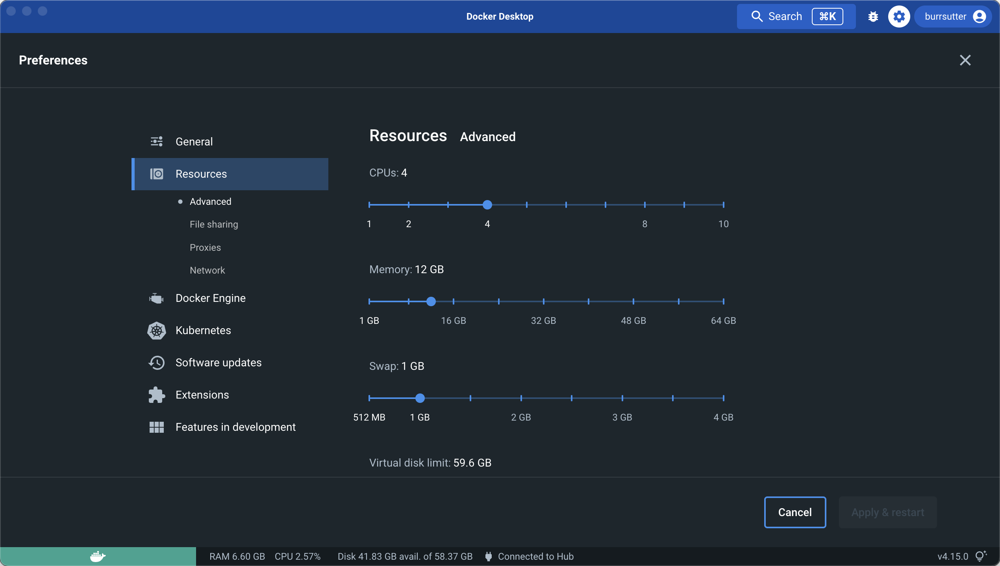

= Way 1: Introduction (Getting Started)

Using KinD which requires Docker

https://kind.sigs.k8s.io/docs/user/quick-start/

https://www.docker.com/products/docker-desktop/

I use Homebrew on MacOS

[.console-input]
[source,bash,subs="+macros,+attributes"]
----
brew install kind
brew install kubectl
brew install yq
brew install jq
brew install kubectx
brew install watch
brew install helm
----

[.console-input]
[source,bash,subs="+macros,+attributes"]
----
kind --version
kind version 0.17.0

kubectl version --short
Client Version: v1.26.1
Kustomize Version: v4.5.7

helm version
version.BuildInfo{Version:"v3.11.0", GitCommit:"472c5736ab01133de504a826bd9ee12cbe4e7904", GitTreeState:"clean", GoVersion:"go1.19.5"}
----

[.console-input]
[source,bash,subs="+macros,+attributes"]
----
mkdir 12wayscloud
cd 12wayscloud
----

[.console-input]
[source,bash,subs="+macros,+attributes"]
----
export KIND_HOME=~/devnation/12wayscloud;
export PATH=$KIND_HOME/bin:$PATH
export KUBECONFIG=$KIND_HOME/.kube/config
export KUBE_EDITOR="code -w"
----

[.console-input]
[source,bash,subs="+macros,+attributes"]
----
cat <<EOF | kind create cluster --name 12ways --config=-
kind: Cluster
apiVersion: kind.x-k8s.io/v1alpha4
nodes:
- role: control-plane
  kubeadmConfigPatches:
  - |
    kind: InitConfiguration
    nodeRegistration:
      kubeletExtraArgs:
        node-labels: "ingress-ready=true"
  extraPortMappings:
  - containerPort: 80
    hostPort: 80
    protocol: TCP
  - containerPort: 443
    hostPort: 443
    protocol: TCP
EOF
----

[.console-input]
[source,bash,subs="+macros,+attributes"]
----
kubectl cluster-info --context kind-12ways
Kubernetes control plane is running at https://127.0.0.1:54904
CoreDNS is running at https://127.0.0.1:54904/api/v1/namespaces/kube-system/services/kube-dns:dns/proxy
----

[.console-input]
[source,bash,subs="+macros,+attributes"]
----
kind get clusters
12ways
----

[.console-input]
[source,bash,subs="+macros,+attributes"]
----
docker ps
CONTAINER ID   IMAGE                  COMMAND                  CREATED          STATUS          PORTS                       NAMES
2c849d23b935   kindest/node:v1.25.3   "/usr/local/bin/entr…"   14 minutes ago   Up 14 minutes   127.0.0.1:54904->6443/tcp   12ways-control-plane
----

[.console-input]
[source,bash,subs="+macros,+attributes"]
----
docker images
REPOSITORY     TAG       IMAGE ID       CREATED        SIZE
kindest/node   <none>    476b7007f4f5   2 months ago   824MB
----

[.console-input]
[source,bash,subs="+macros,+attributes"]
----
kubectl get nodes
NAME                   STATUS   ROLES           AGE   VERSION
12ways-control-plane   Ready    control-plane   15m   v1.25.3
----

Max Pods

[.console-input]
[source,bash,subs="+macros,+attributes"]
----
kubectl get node 12ways-control-plane -ojsonpath='{.status.capacity.pods}'
110
----

Max Cores

[.console-input]
[source,bash,subs="+macros,+attributes"]
----
kubectl get node 12ways-control-plane -ojsonpath='{.status.capacity.cpu}'
4
----

Max Memory

[.console-input]
[source,bash,subs="+macros,+attributes"]
----
kubectl get node 12ways-control-plane -ojsonpath='{.status.capacity.memory}'
----

[.console-output]
[source,bash,subs="+macros,+attributes"]
----
12250528Ki
----

Defined by Docker

[.console-input]
[source,bash,subs="+macros,+attributes"]
----
docker stats
CONTAINER ID   NAME                   CPU %     MEM USAGE / LIMIT   MEM %     NET I/O          BLOCK I/O    PIDS
2c849d23b935   12ways-control-plane   26.77%    529MiB / 11.68GiB   4.42%     48.8kB / 197kB   0B / 627MB   251
----

[.console-input]
[source,bash,subs="+macros,+attributes"]
----
docker exec -it 12ways-control-plane /bin/sh

top
top - 23:52:03 up 16:57,  0 users,  load average: 0.39, 0.33, 0.29
Tasks:  33 total,   1 running,  32 sleeping,   0 stopped,   0 zombie
%Cpu(s):  2.2 us,  1.8 sy,  0.0 ni, 95.9 id,  0.0 wa,  0.0 hi,  0.1 si,  0.0 st
MiB Mem :  11963.4 total,   8512.5 free,    801.7 used,   2649.3 buff/cache
MiB Swap:   1024.0 total,   1024.0 free,      0.0 used.  10610.8 avail Mem

    PID USER      PR  NI    VIRT    RES    SHR S  %CPU  %MEM     TIME+ COMMAND
    553 root      20   0 1059400 309228  55188 S   9.3   2.5   2:50.90 kube-apiserver
    561 root      20   0  770464  79952  43028 S   5.3   0.7   1:20.64 kube-controller
    639 root      20   0   10.7g  49836  21816 S   4.7   0.4   1:44.78 etcd
    697 root      20   0 1880816  79008  46348 S   4.0   0.6   1:29.56 kubelet
     99 root      20   0 2297184  55336  27748 S   2.3   0.5   0:40.10 containerd
    533 root      20   0  758208  51892  35444 S   1.3   0.4   0:16.04 kube-scheduler
   1238 root      20   0  751544  44712  33164 S   0.7   0.4   0:07.61 coredns
    316 root      20   0  711960   9120   6896 S   0.3   0.1   0:01.48 containerd-shim
    845 root      20   0  711960   9140   7152 S   0.3   0.1   0:01.06 containerd-shim
    929 root      20   0  752416  37808  29416 S   0.3   0.3   0:01.05 kube-proxy
----

What is running on my cluster now?

[.console-input]
[source,bash,subs="+macros,+attributes"]
----
kubectl get pods -A
NAMESPACE            NAME                                           READY   STATUS    RESTARTS   AGE
kube-system          coredns-565d847f94-g4j5m                       1/1     Running   0          9m41s
kube-system          coredns-565d847f94-rrhw8                       1/1     Running   0          9m41s
kube-system          etcd-12ways-control-plane                      1/1     Running   0          9m55s
kube-system          kindnet-mppcj                                  1/1     Running   0          9m41s
kube-system          kube-apiserver-12ways-control-plane            1/1     Running   0          9m55s
kube-system          kube-controller-manager-12ways-control-plane   1/1     Running   0          9m56s
kube-system          kube-proxy-gphrh                               1/1     Running   0          9m41s
kube-system          kube-scheduler-12ways-control-plane            1/1     Running   0          9m56s
local-path-storage   local-path-provisioner-684f458cdd-86drl        1/1     Running   0          9m41s
----

=== Ingress Installation

[.console-input]
[source,bash,subs="+macros,+attributes"]
----
kubectl apply -f https://raw.githubusercontent.com/kubernetes/ingress-nginx/main/deploy/static/provider/kind/deploy.yaml
----

Wait for it
[.console-input]
[source,bash,subs="+macros,+attributes"]
----
kubectl wait --namespace ingress-nginx \
  --for=condition=ready pod \
  --selector=app.kubernetes.io/component=controller \
  --timeout=90s
----

What is running now?

[.console-input]
[source,bash,subs="+macros,+attributes"]
----
kubectl get pods -A
NAMESPACE            NAME                                           READY   STATUS      RESTARTS   AGE
ingress-nginx        ingress-nginx-admission-create-xhgt9           0/1     Completed   0          18s
ingress-nginx        ingress-nginx-admission-patch-khrfp            0/1     Completed   0          18s
ingress-nginx        ingress-nginx-controller-6bccc5966-sxmlp       0/1     Running     0          18s
kube-system          coredns-565d847f94-g4j5m                       1/1     Running     0          10m
kube-system          coredns-565d847f94-rrhw8                       1/1     Running     0          10m
kube-system          etcd-12ways-control-plane                      1/1     Running     0          10m
kube-system          kindnet-mppcj                                  1/1     Running     0          10m
kube-system          kube-apiserver-12ways-control-plane            1/1     Running     0          10m
kube-system          kube-controller-manager-12ways-control-plane   1/1     Running     0          10m
kube-system          kube-proxy-gphrh                               1/1     Running     0          10m
kube-system          kube-scheduler-12ways-control-plane            1/1     Running     0          10m
local-path-storage   local-path-provisioner-684f458cdd-86drl        1/1     Running     0          10m
----

Create an application pod for testing

In one window, watch events

[.console-input]
[source,bash,subs="+macros,+attributes"]
----
watch kubectl get events --sort-by=.metadata.creationTimestamp
----

In another window, create a Namespace and a Deployment

[.console-input]
[source,bash,subs="+macros,+attributes"]
----
kubectl create namespace mystuff
kubectl config set-context --current --namespace=mystuff

kubectl create deployment myapp --image=quay.io/rhdevelopers/quarkus-demo:v1
----

watch kubectl get events output

[.console-output]
[source,bash,subs="+macros,+attributes"]
----
LAST SEEN   TYPE     REASON              OBJECT                        MESSAGE
9s          Normal   Scheduled           pod/myapp-85cf5bbddb-j8z4t    Successfully assigned mystuff/myapp-85cf5bbddb-j8z4t to 12ways-control
-plane
9s          Normal   Pulling             pod/myapp-85cf5bbddb-j8z4t    Pulling image "quay.io/rhdevelopers/quarkus-demo:v1"
9s          Normal   SuccessfulCreate    replicaset/myapp-85cf5bbddb   Created pod: myapp-85cf5bbddb-j8z4t
9s          Normal   ScalingReplicaSet   deployment/myapp              Scaled up replica set myapp-85cf5bbddb to 1
5s          Normal   Pulled              pod/myapp-85cf5bbddb-j8z4t    Successfully pulled image "quay.io/rhdevelopers/quarkus-demo:v1" in 3.
30316846s
5s          Normal   Created             pod/myapp-85cf5bbddb-j8z4t    Created container quarkus-demo
5s          Normal   Started             pod/myapp-85cf5bbddb-j8z4t    Started container quarkus-demo
----

[.console-input]
[source,bash,subs="+macros,+attributes"]
----
kubectl expose deployment myapp --port=8080 --type=LoadBalancer
----

[.console-input]
[source,bash,subs="+macros,+attributes"]
----
kubectl get services
NAME    TYPE           CLUSTER-IP     EXTERNAL-IP   PORT(S)          AGE
myapp   LoadBalancer   10.96.93.230   <pending>     8080:30099/TCP   4s
----

Ingress 

[.console-input]
[source,bash,subs="+macros,+attributes"]
----
cat <<EOF | kubectl apply -f -
apiVersion: networking.k8s.io/v1
kind: Ingress
metadata:
  name: myapp-ingress
  annotations:
    nginx.ingress.kubernetes.io/rewrite-target: /$2
spec:
  rules:
  - http:
      paths:
      - pathType: Prefix
        path: /myapp(/|$)(.*)
        backend:
          service:
            name: myapp
            port:
              number: 8080
EOF
----

OR Forward but you lose load-balancing!

[.console-input]
[source,bash,subs="+macros,+attributes"]
----
kubectl port-forward service/myapp 8080:8080
----

[.console-input]
[source,bash,subs="+macros,+attributes"]
----
curl localhost:80/myapp
Supersonic Subatomic Java with Quarkus myapp-85cf5bbddb-j8z4t:1
----

[.console-input]
[source,bash,subs="+macros,+attributes"]
----
while true
do curl localhost:80/myapp
sleep .3
done
----

[.console-input]
[source,bash,subs="+macros,+attributes"]
----
kubectl scale deployment myapp --replicas=2
----

[.console-input]
[source,bash,subs="+macros,+attributes"]
----
kubectl get pods
NAME                     READY   STATUS    RESTARTS   AGE
myapp-85cf5bbddb-n8tdk   1/1     Running   0          2m2s
myapp-85cf5bbddb-ts6fb   1/1     Running   0          18m
----

[.console-output]
[source,bash,subs="+macros,+attributes"]
----
Supersonic Subatomic Java with Quarkus myapp-85cf5bbddb-ts6fb:32
Supersonic Subatomic Java with Quarkus myapp-85cf5bbddb-n8tdk:2
Supersonic Subatomic Java with Quarkus myapp-85cf5bbddb-n8tdk:3
Supersonic Subatomic Java with Quarkus myapp-85cf5bbddb-ts6fb:33
Supersonic Subatomic Java with Quarkus myapp-85cf5bbddb-n8tdk:4
Supersonic Subatomic Java with Quarkus myapp-85cf5bbddb-ts6fb:34
----

=== Clean MyStuff

[.console-input]
[source,bash,subs="+macros,+attributes"]
----
kubectl delete namespace mystuff
----

=== Overall Tutorial Clean Up

Clean up KinD
----
kind delete cluster --name 12ways
----

----
rm -rf .kube
----

Clean up Docker

If you wish to more fully scrub all things from your Docker Daemon to get back to a fresh start
----
docker rm `docker ps -a -q`
docker rmi `docker images -a -q`
----
