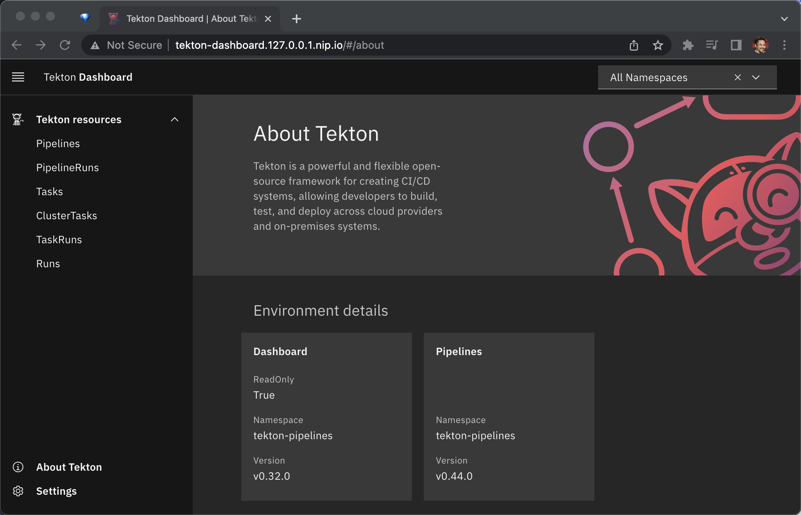

= Way 10: Tekton

https://github.com/tektoncd/dashboard/blob/main/docs/walkthrough/walkthrough-kind.md

[.console-input]
[source,bash,subs="+macros,+attributes"]
----
brew install tektoncd-cli
----

[.console-input]
[source,bash,subs="+macros,+attributes"]
----
export KIND_HOME=~/devnation/12wayscloud;
export PATH=$KIND_HOME/bin:$PATH
export KUBECONFIG=$KIND_HOME/.kube/config
export KUBE_EDITOR="code -w"
----

[.console-input]
[source,bash,subs="+macros,+attributes"]
----
cat <<EOF | kind create cluster --name 12ways --config=-
kind: Cluster
apiVersion: kind.x-k8s.io/v1alpha4
nodes:
- role: control-plane
  kubeadmConfigPatches:
  - |
    kind: InitConfiguration
    nodeRegistration:
      kubeletExtraArgs:
        node-labels: "ingress-ready=true"
  extraPortMappings:
  - containerPort: 80
    hostPort: 80
    protocol: TCP
  - containerPort: 443
    hostPort: 443
    protocol: TCP
EOF
----

=== Ingress Nginx Installation

[.console-input]
[source,bash,subs="+macros,+attributes"]
----
kubectl apply -f https://raw.githubusercontent.com/kubernetes/ingress-nginx/main/deploy/static/provider/kind/deploy.yaml
----

Wait for it
[.console-input]
[source,bash,subs="+macros,+attributes"]
----
kubectl wait --namespace ingress-nginx \
  --for=condition=ready pod \
  --selector=app.kubernetes.io/component=controller \
  --timeout=90s
----

What is running now?

[.console-input]
[source,bash,subs="+macros,+attributes"]
----
kubectl get pods -A
NAMESPACE            NAME                                           READY   STATUS      RESTARTS   AGE
ingress-nginx        ingress-nginx-admission-create-xhgt9           0/1     Completed   0          18s
ingress-nginx        ingress-nginx-admission-patch-khrfp            0/1     Completed   0          18s
ingress-nginx        ingress-nginx-controller-6bccc5966-sxmlp       0/1     Running     0          18s
kube-system          coredns-565d847f94-g4j5m                       1/1     Running     0          10m
kube-system          coredns-565d847f94-rrhw8                       1/1     Running     0          10m
kube-system          etcd-12ways-control-plane                      1/1     Running     0          10m
kube-system          kindnet-mppcj                                  1/1     Running     0          10m
kube-system          kube-apiserver-12ways-control-plane            1/1     Running     0          10m
kube-system          kube-controller-manager-12ways-control-plane   1/1     Running     0          10m
kube-system          kube-proxy-gphrh                               1/1     Running     0          10m
kube-system          kube-scheduler-12ways-control-plane            1/1     Running     0          10m
local-path-storage   local-path-provisioner-684f458cdd-86drl        1/1     Running     0          10m
----

=== Check CPU and Memory

[.console-input]
[source,bash,subs="+macros,+attributes"]
----
kubectl get node 12ways-control-plane -ojsonpath='{.status.capacity.cpu}'
----

[.console-output]
[source,bash,subs="+macros,+attributes"]
----
6
----

Max Memory

[.console-input]
[source,bash,subs="+macros,+attributes"]
----
kubectl get node 12ways-control-plane -ojsonpath='{.status.capacity.memory}'
----

[.console-output]
[source,bash,subs="+macros,+attributes"]
----
12250528Ki
----

=== Tekton

[.console-input]
[source,bash,subs="+macros,+attributes"]
----
kubectl apply --filename https://storage.googleapis.com/tekton-releases/pipeline/latest/release.yaml

kubectl wait -n tekton-pipelines \
  --for=condition=ready pod \
  --selector=app.kubernetes.io/part-of=tekton-pipelines,app.kubernetes.io/component=controller \
  --timeout=90s
----

[.console-input]
[source,bash,subs="+macros,+attributes"]
----
kubectl get crds | grep tekton
----

[.console-output]
[source,bash,subs="+macros,+attributes"]
----
clustertasks.tekton.dev                    2023-01-29T23:42:34Z
customruns.tekton.dev                      2023-01-29T23:42:34Z
pipelineresources.tekton.dev               2023-01-29T23:42:34Z
pipelineruns.tekton.dev                    2023-01-29T23:42:34Z
pipelines.tekton.dev                       2023-01-29T23:42:34Z
resolutionrequests.resolution.tekton.dev   2023-01-29T23:42:34Z
runs.tekton.dev                            2023-01-29T23:42:34Z
taskruns.tekton.dev                        2023-01-29T23:42:34Z
tasks.tekton.dev                           2023-01-29T23:42:34Z
verificationpolicies.tekton.dev            2023-01-29T23:42:34Z
----

Dashboard

[.console-input]
[source,bash,subs="+macros,+attributes"]
----
curl -sL https://raw.githubusercontent.com/tektoncd/dashboard/main/scripts/release-installer | \
   bash -s -- install latest

kubectl wait -n tekton-pipelines \
  --for=condition=ready pod \
  --selector=app.kubernetes.io/part-of=tekton-dashboard,app.kubernetes.io/component=dashboard \
  --timeout=90s
----

[.console-input]
[source,bash,subs="+macros,+attributes"]
----
kubectl apply -n tekton-pipelines -f - <<EOF
apiVersion: networking.k8s.io/v1
kind: Ingress
metadata:
  name: tekton-dashboard
spec:
  rules:
  - host: tekton-dashboard.127.0.0.1.nip.io
    http:
      paths:
      - pathType: ImplementationSpecific
        backend:
          service:
            name: tekton-dashboard
            port:
              number: 9097
EOF
----

[.console-input]
[source,bash,subs="+macros,+attributes"]
----
open http://tekton-dashboard.127.0.0.1.nip.io
----

[.console-input]
[source,bash,subs="+macros,+attributes"]
----
tkn version
----

[.console-output]
[source,bash,subs="+macros,+attributes"]
----
Client version: 0.29.0
Pipeline version: v0.44.0
Dashboard version: v0.32.0
----

https://redhat-scholars.github.io/tekton-tutorial/tekton-tutorial/setup.html

https://dn.dev/tekton-tutorial

[.console-input]
[source,bash,subs="+macros,+attributes"]
----
kubectl create namespace tektontutorial
kubectl config set-context --current --namespace=tektontutorial
----

Tasks

[.console-input]
[source,bash,subs="+macros,+attributes"]
----
tkn task ls
----

----
No Tasks found
----

Hello 

[.console-input]
[source,bash,subs="+macros,+attributes"]
----
cat <<EOF | kubectl apply -f -
apiVersion: tekton.dev/v1
kind: Task
metadata:
  name: hello
spec:
  steps:
    - name: echo
      image: alpine
      script: |
        #!/bin/sh
        echo "Hello World"      
EOF
----

[.console-input]
[source,bash,subs="+macros,+attributes"]
----
tkn task ls
----

----
NAME    DESCRIPTION   AGE
hello                 6 seconds ago
----

[.console-input]
[source,bash,subs="+macros,+attributes"]
----
watch kubectl get pods
----

[.console-input]
[source,bash,subs="+macros,+attributes"]
----
cat <<EOF | kubectl apply -f -
apiVersion: tekton.dev/v1
kind: TaskRun
metadata:
  name: hello-task-run
spec:
  taskRef:
    name: hello
EOF
----

[.console-input]
[source,bash,subs="+macros,+attributes"]
----
watch kubectl get pods
NAME                 READY   STATUS     RESTARTS   AGE
hello-task-run-pod   0/1     Init:1/2   0          5s
----

[.console-input]
[source,bash,subs="+macros,+attributes"]
----
NAME                 READY   STATUS      RESTARTS   AGE
hello-task-run-pod   0/1     Completed   0          7s
----

[.console-input]
[source,bash,subs="+macros,+attributes"]
----
stern hello-task
+ hello-task-run-pod › step-echo
hello-task-run-pod step-echo Hello World
- hello-task-run-pod › step-echo
----

[.console-input]
[source,bash,subs="+macros,+attributes"]s
----
tkn task logs hello
----

----
Hello World
----

[.console-input]
[source,bash,subs="+macros,+attributes"]
----
kubectl delete taskrun hello-task-run
----

And the Completed Pod goes away

----
kubectl logs --selector=tekton.dev/taskRun=hello-task-run
----

[.console-input]
[source,bash,subs="+macros,+attributes"]
----
git clone https://github.com/redhat-scholars/tekton-tutorial
----

[.console-input]
[source,bash,subs="+macros,+attributes"]
----
kubectl apply -n tektontutorial -f tekton-stuff/source-lister.yaml
----

[.console-output]
[source,bash,subs="+macros,+attributes"]
----
tkn task ls
----

----
NAME            DESCRIPTION   AGE
source-lister                 16 seconds ago
----

[.console-input]
[source,bash,subs="+macros,+attributes"]
----
tkn task describe source-lister
----

[.console-input]
[source,bash,subs="+macros,+attributes"]
----
tkn task start source-lister --showlog
----

