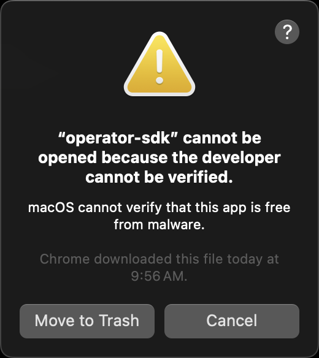
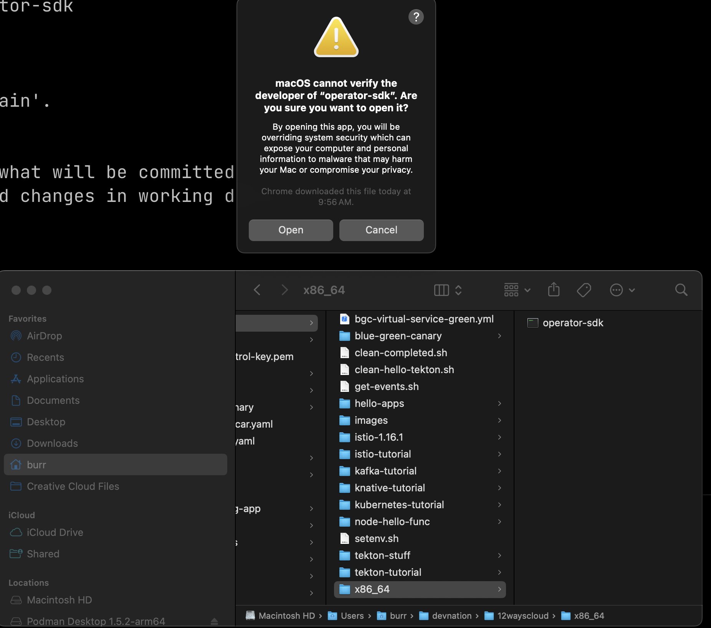
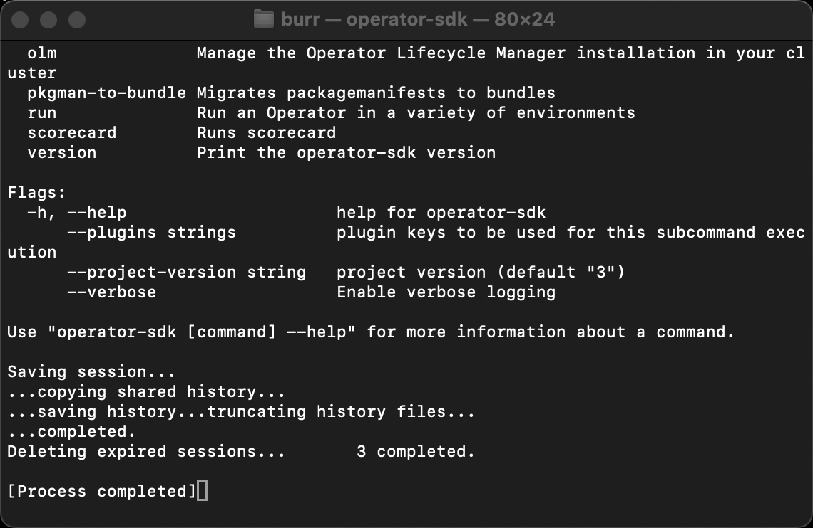

= Way 3: Extending Kubernetes

https://javaoperatorsdk.io/docs/getting-started

https://developers.redhat.com/articles/2022/03/22/write-kubernetes-java-java-operator-sdk-part-2#implement_the_controller

This tutorial requires an active connection to your cluster where you are cluster admin.  I am using KinD

[.console-input]
[source,bash,subs="+macros,+attributes"]
----
cat <<EOF | kind create cluster --name 12ways --config=-
kind: Cluster
apiVersion: kind.x-k8s.io/v1alpha4
nodes:
- role: control-plane
  kubeadmConfigPatches:
  - |
    kind: InitConfiguration
    nodeRegistration:
      kubeletExtraArgs:
        node-labels: "ingress-ready=true"
  extraPortMappings:
  - containerPort: 80
    hostPort: 80
    protocol: TCP
  - containerPort: 443
    hostPort: 443
    protocol: TCP
EOF
----

There should be no CRDs in the average KinD cluster.  Other clusters may be many CRDs pre-loaded depending on vendor

----
kubectl get crds
----

----
go version
go version go1.19.5 darwin/arm64
----

----
java -version
openjdk version "17.0.3" 2022-04-19
OpenJDK Runtime Environment Temurin-17.0.3+7 (build 17.0.3+7)
OpenJDK 64-Bit Server VM Temurin-17.0.3+7 (build 17.0.3+7, mixed mode, sharing)
----

----
mvn -v
Apache Maven 3.8.5 (3599d3414f046de2324203b78ddcf9b5e4388aa0)
Maven home: /Users/burr/.sdkman/candidates/maven/current
Java version: 17.0.3, vendor: Eclipse Adoptium, runtime: /Users/burr/.sdkman/candidates/java/17.0.3-tem
Default locale: en_US, platform encoding: UTF-8
OS name: "mac os x", version: "14.0", arch: "x86_64", family: "mac"
---- 

Download operator-sdk

https://mirror.openshift.com/pub/openshift-v4/x86_64/clients/operator-sdk/4.13.19/

----
cd /Users/burr/devnation/12wayscloud
mv ~/Downloads/operator-sdk-darwin-x86_64.tar.gz .
tar xvf operator-sdk-darwin-x86_64.tar.gz
rm operator-sdk-darwin-x86_64.tar.gz

chmod +x ./x86_64/operator-sdk
----

Getting a new binary to work on a Mac requires some tricks

https://support.apple.com/guide/mac-help/open-a-mac-app-from-an-unidentified-developer-mh40616/mac

Once you are through that process it works at the command line

----
./x86_64/operator-sdk version
operator-sdk version: "v1.28.0-ocp", commit: "a8fab649e0c0f861e45d20d172a06b2c8018f604", kubernetes version: "v1.26.0", go version: "go1.19.13", GOOS: "darwin", GOARCH: "amd64"
----

Add to PATH
----
export PATH=/Users/burr/devnation/12wayscloud/x86_64/:$PATH
----

Generate a skeleton 

----
mkdir greeting-operator
cd greeting-operator
operator-sdk init --plugins quarkus --domain burrsutter.com --project-name greeting
----

----
tree
.
├── Makefile
├── PROJECT
├── pom.xml
└── src
    └── main
        ├── java
        └── resources
            └── application.properties

5 directories, 4 files
----

----
mvn quarkus:dev
----

----
operator-sdk create api --version v1alpha1 --kind Greeting
----

----
tree
.
├── Makefile
├── PROJECT
├── pom.xml
├── src
│   └── main
│       ├── java
│       │   └── com
│       │       └── burrsutter
│       │           ├── Greeting.java
│       │           ├── GreetingReconciler.java
│       │           ├── GreetingSpec.java
│       │           └── GreetingStatus.java
│       └── resources
│           └── application.properties
└── target
    ├── build-metrics.json
    ├── classes
    │   ├── application.properties
    │   └── com
    │       └── burrsutter
    │           ├── Greeting.class
    │           ├── GreetingReconciler.class
    │           ├── GreetingSpec.class
    │           └── GreetingStatus.class
    ├── generated-sources
    │   └── annotations
    ├── greeting-dev.jar
    ├── kubernetes
    │   ├── kubernetes.json
    │   └── kubernetes.yml
    ├── maven-status
    │   └── maven-compiler-plugin
    │       └── compile
    │           └── null
    │               ├── createdFiles.lst
    │               └── inputFiles.lst
    ├── quarkus
    │   └── bootstrap
    │       └── dev-app-model.dat
    └── test-classes

21 directories, 20 files
----

Error on the `mvn quarkus:dev` mode terminal

----
2023-11-05 10:53:09,759 ERROR [io.qua.run.Application] (Quarkus Main Thread) Failed to start application (with profile [dev]): io.javaoperatorsdk.operator.MissingCRDException: 'greetings.burrsutter.com' v1 CRD was not found on the cluster, controller 'greetingreconciler' cannot be registered
----

edit application.properties
----
# set to true to automatically apply CRDs to the cluster when they get regenerated
quarkus.operator-sdk.crd.apply=true
----

Restart `mvn quarkus:dev`

and there should be no more errors, the Reconciler runs inside of the dev mode
----
2023-11-05 11:16:57,203 INFO  [io.jav.ope.pro.Controller] (Controller Starter for: greetingreconciler) Starting 'greetingreconciler' controller for reconciler: com.burrsutter.GreetingReconciler, resource: com.burrsutter.Greeting
----

Note: when you leave dev mode, you wish to apply the Controller manually to the cluster

And you should find the CRD is now in the KinD cluster

----
kubectl get crds
NAME                           CREATED AT
greetings.burrsutter.com       2023-11-05T15:59:22Z
----

----
kubectl describe crd greeting
Name:         greetings.burrsutter.com
Namespace:
Labels:       <none>
Annotations:  <none>
API Version:  apiextensions.k8s.io/v1
Kind:         CustomResourceDefinition
Metadata:
  Creation Timestamp:  2023-11-05T15:59:22Z
  Generation:          1
  Resource Version:    44291
  UID:                 99578bb4-ad64-4860-94b5-2d2b3f1c1f31
Spec:
  Conversion:
    Strategy:  None
  Group:       burrsutter.com
  Names:
    Kind:       Greeting
    List Kind:  GreetingList
    Plural:     greetings
    Singular:   greeting
  Scope:        Namespaced
  Versions:
    Name:  v1alpha1
    Schema:
      openAPIV3Schema:
        Properties:
          Spec:
            Type:  object
          Status:
            Type:  object
        Type:      object
    Served:        true
    Storage:       true
    Subresources:
      Status:
Status:
  Accepted Names:
    Kind:       Greeting
    List Kind:  GreetingList
    Plural:     greetings
    Singular:   greeting
  Conditions:
    Last Transition Time:  2023-11-05T15:59:22Z
    Message:               no conflicts found
    Reason:                NoConflicts
    Status:                True
    Type:                  NamesAccepted
    Last Transition Time:  2023-11-05T15:59:22Z
    Message:               the initial names have been accepted
    Reason:                InitialNamesAccepted
    Status:                True
    Type:                  Established
  Stored Versions:
    v1alpha1
Events:  <none>
----

----
kubectl explain greeting
GROUP:      burrsutter.com
KIND:       Greeting
VERSION:    v1alpha1

DESCRIPTION:
    <empty>
FIELDS:
  apiVersion	<string>
    APIVersion defines the versioned schema of this representation of an object.
    Servers should convert recognized schemas to the latest internal value, and
    may reject unrecognized values. More info:
    https://git.k8s.io/community/contributors/devel/sig-architecture/api-conventions.md#resources

  kind	<string>
    Kind is a string value representing the REST resource this object
    represents. Servers may infer this from the endpoint the client submits
    requests to. Cannot be updated. In CamelCase. More info:
    https://git.k8s.io/community/contributors/devel/sig-architecture/api-conventions.md#types-kinds

  metadata	<ObjectMeta>
    Standard object's metadata. More info:
    https://git.k8s.io/community/contributors/devel/sig-architecture/api-conventions.md#metadata

  spec	<Object>
    <no description>

  status	<Object>
    <no description>
----

----
kubectl api-resources | grep greeting
greetings                                      burrsutter.com/v1alpha1                true         Greeting
----

Add some fields

edit GreetingSpec.java

----
package com.burrsutter;

import com.fasterxml.jackson.annotation.JsonProperty;
import com.fasterxml.jackson.databind.annotation.JsonDeserialize;

import io.quarkus.runtime.annotations.RegisterForReflection;

@JsonDeserialize
@RegisterForReflection

public class GreetingSpec {

    // Add Spec information here
    @JsonProperty("hello")
    private String hello;

    public String getHello() {
        return hello;
    }

    public void setHello(String hello) {
        this.hello = hello;
    }
}
----

review changes in the generated CRD.yml
----
./target/kubernetes/greetings.burrsutter.com-v1.yml
----

If you need to, you can manually replace CRD on cluster, but these changes should be automatically applied while in mvn quarkus:dev mode
----
kubectl replace -f ./target/kubernetes/greetings.burrsutter.com-v1.yml
----

Create a CR based on the CRD
----
cat <<EOF | kubectl apply -f -
apiVersion: burrsutter.com/v1alpha1
kind: Greeting
metadata:
  name: holagreeting
spec:
  hello: hola
EOF
----

----
kubectl get greetings
NAME           AGE
holagreeting   4s
----

----
kubectl describe greeting holagreeting
Name:         holagreeting
Namespace:    default
Labels:       <none>
Annotations:  <none>
API Version:  burrsutter.com/v1alpha1
Kind:         Greeting
Metadata:
  Creation Timestamp:  2023-11-05T16:29:27Z
  Generation:          1
  Resource Version:    46870
  UID:                 abfc32cc-c5aa-4da1-ab56-40437417fbbf
Spec:
  Hello:  hola
Events:   <none>
----

----
kubectl delete greeting holagreeting
----

Now let's work on the Controller that responds to Greeting CRs

Open GreetingReconciler.java

Add annotation to scope to current namespace 
----
@ControllerConfiguration(namespaces = Constants.WATCH_CURRENT_NAMESPACE, name = "greeting")
public class GreetingReconciler implements Reconciler<Greeting> { 
----

Save and it should auto-reload

----
2023-11-05 11:40:56,792 INFO  [io.jav.ope.Operator] (Quarkus Main Thread) Registered reconciler: 'greeting' for resource: 'class com.burrsutter.Greeting' for namespace(s): [default]
----

Add logic to spin up a pod associated with the CR

----
  @Override
  public UpdateControl<Greeting> reconcile(Greeting resource, Context context) {
    // TODO: fill in logic
    final var name=resource.getMetadata().getName();
    final var spec=resource.getSpec();
    final var hello=spec.getHello();

    final Map<String, String> labels = new HashMap<>();
    labels.put("app", name);

    System.out.println("You want a Greeting pod with hello: " + hello);

    final ObjectMetaBuilder objectMetaBuilder = new ObjectMetaBuilder().withName(name + "-pod")
      .withNamespace(resource.getMetadata().getNamespace()).withLabels(labels);

    final ContainerBuilder containerBuilder = new ContainerBuilder().withName("hello-container")
      .withImage("docker.io/burrsutter/quarkus-demo:v1");

    final PodSpecBuilder podSpecBuilder = new PodSpecBuilder().withContainers(containerBuilder.build())
      .withRestartPolicy("Never");

    final PodBuilder podBuilder = new PodBuilder().withMetadata(objectMetaBuilder.build())
      .withSpec(podSpecBuilder.build());

    final Pod pod = podBuilder.build();

    client.resource(pod).createOrReplace();

    return UpdateControl.noUpdate(); // do not update the CR
  }

----

Save the changes, the mvn quarkus:dev should auto-reload and be waiting

Add a CR for hola
----
cat <<EOF | kubectl apply -f -
apiVersion: burrsutter.com/v1alpha1
kind: Greeting
metadata:
  name: holagreeting
spec:
  hello: hola
EOF
----

----
kubectl get pods --show-labels
NAME               READY   STATUS    RESTARTS   AGE   LABELS
holagreeting-pod   1/1     Running   0          71s   app=holagreeting
----

Add another CR

----
cat <<EOF | kubectl apply -f -
apiVersion: burrsutter.com/v1alpha1
kind: Greeting
metadata:
  name: bonjourgreeting
spec:
  hello: bonjour
EOF
----

----
kubectl get pods --show-labels
NAME                  READY   STATUS    RESTARTS   AGE     LABELS
bonjourgreeting-pod   1/1     Running   0          8s      app=bonjourgreeting
holagreeting-pod      1/1     Running   0          2m11s   app=holagreeting
----

----
kubectl get greetings
NAME              AGE
bonjourgreeting   28s
holagreeting      2m30s
----

This controller does not have the logic to delete the pods it spun up

----
kubectl delete prod bonjourgreeting-pod
kubectl delete prod holagreeting-pod
----

Delete the CRs
----
kubectl delete greeting bonjourgreeting
kubectl delete greeting holagreeting
----

Make this ready as a simple Controller

----
mvn clean compile package
----

Note: an Operator Lifecycle Managed Operator requires some additional steps

Create a Dockerfile under src/main/docker/Dockerfile.jvm
----
FROM registry.access.redhat.com/ubi8/openjdk-17:1.17

ENV LANGUAGE='en_US:en'

COPY --chown=185 target/quarkus-app/lib/ /deployments/lib/
COPY --chown=185 target/quarkus-app/*.jar /deployments/
COPY --chown=185 target/quarkus-app/app/ /deployments/app/
COPY --chown=185 target/quarkus-app/quarkus/ /deployments/quarkus/

EXPOSE 8080
USER 185
ENV JAVA_OPTS_APPEND="-Dquarkus.http.host=0.0.0.0 -Djava.util.logging.manager=org.jboss.logmanager.LogManager"
ENV JAVA_APP_JAR="/deployments/quarkus-run.jar"

ENTRYPOINT [ "/opt/jboss/container/java/run/run-java.sh" ]
----

Build and publish, controllers are container images

----
export IMAGE_VER=greeting-operator:0.0.1-SNAPSHOT

docker build -f src/main/docker/Dockerfile.jvm -t burrsutter/$IMAGE_VER .
docker login docker.io
docker tag burrsutter/$IMAGE_VER docker.io/burrsutter/$IMAGE_VER
docker push docker.io/burrsutter/$IMAGE_VER
----

open https://hub.docker.com/r/burrsutter/greeting-operator/tags

Let's see if we can use this Controller and CRD

Burn down previous cluster for a clean slate
----
kind delete cluster --name 12ways
----

Rebuild cluster for a clean slate

----
cat <<EOF | kind create cluster --name 12ways --config=-
kind: Cluster
apiVersion: kind.x-k8s.io/v1alpha4
nodes:
- role: control-plane
  kubeadmConfigPatches:
  - |
    kind: InitConfiguration
    nodeRegistration:
      kubeletExtraArgs:
        node-labels: "ingress-ready=true"
  extraPortMappings:
  - containerPort: 80
    hostPort: 80
    protocol: TCP
  - containerPort: 443
    hostPort: 443
    protocol: TCP
EOF
----

the CRD and Deployment yaml were generated via the SDK into the target directory.  This directory is modified often and can be removed via `mvn clean` so I will make a copy of the key files for safekeeping

----
cp ./target/kubernetes/greetings.burrsutter.com-v1.yml ../greeting-operator-yamls
----

----
cp ./target/kubernetes/kubernetes.yml ../greeting-operator-yamls/greeting-operator.yml
----

And the greeting-operator.yml does not have the correct container identifier since I manually created the docker image, just tweak the file

----
          image: burrsutter/greeting-operator:0.0.1-SNAPSHOT
----

Now deploy the CRD

----
/Users/burr/devnation/12wayscloud

kubectl apply -f greeting-operator-yamls/greetings.burrsutter.com-v1.yml
----

----
kubectl get crds
NAME                       CREATED AT
greetings.burrsutter.com   2023-11-05T18:17:43Z
----

Create a namespace to work inside
----
kubectl create namespace mygreetings
kubectl config set-context --current --namespace=mygreetings
----

Update the ClusterRoleBinding in greeting-operator.yml

----
apiVersion: rbac.authorization.k8s.io/v1
kind: ClusterRoleBinding
metadata:
  name: greeting-crd-validating-role-binding
roleRef:
  kind: ClusterRole
  apiGroup: rbac.authorization.k8s.io
  name: josdk-crd-validating-cluster-role
subjects:
  - kind: ServiceAccount
    name: greeting-operator
    namespace: mygreetings
----

And

----
apiVersion: v1
kind: ServiceAccount
metadata:
  annotations:
    app.quarkus.io/commit-id: 00e878db997575d5072cb627c5f55a7e191635d1
    app.quarkus.io/build-timestamp: 2023-11-05 - 17:50:52 +0000
  labels:
    app.kubernetes.io/version: 0.0.1-SNAPSHOT
    app.kubernetes.io/name: greeting-operator
  name: greeting-operator
  namespace: mygreetings
----

And

----
apiVersion: rbac.authorization.k8s.io/v1
kind: RoleBinding
metadata:
  name: greeting-role-binding
roleRef:
  kind: ClusterRole
  apiGroup: rbac.authorization.k8s.io
  name: greeting-cluster-role
subjects:
  - kind: ServiceAccount
    name: greeting-operator
    namespace: mygreetings
----

And update the ClusterRole entry

----
apiVersion: rbac.authorization.k8s.io/v1
kind: ClusterRole
metadata:
  name: greeting-cluster-role
rules:
  - apiGroups:
    - ''
    resources:
      - pods
      - greetings
      - greetings/status
      - greetings/finalizers
    verbs:
      - get
      - list
      - watch
      - patch
      - update
      - create
      - delete
  - apiGroups:
    - burrsutter.com
    resources:
    - greetings
    verbs:
    - list
    - watch
----

and Deploy the Controller

----
kubectl apply -f greeting-operator-yamls/greeting-operator.yml
----

----
NAME                                 READY   STATUS    RESTARTS   AGE
greeting-operator-6cc8c477dd-ngbxg   1/1     Running   0          17s
----

----
stern greeting-operator
----

----
cat <<EOF | kubectl apply -f -
apiVersion: burrsutter.com/v1alpha1
kind: Greeting
metadata:
  name: alohagreeting
spec:
  hello: aloha
EOF
----

Look for your newly manufactured pod
----
kubectl get pods
NAME                                 READY   STATUS    RESTARTS   AGE
alohagreeting-pod                    1/1     Running   0          5s
greeting-operator-6cc8c477dd-w8qlc   1/1     Running   0          19s
----

and the output from Stern

----
kubernetes-client, micrometer, openshift-client, operator-sdk, smallrye-context-propagation, smallrye-health, vertx]
greeting-operator-6cc8c477dd-w8qlc greeting-operator You want a Greeting pod with hello: aloha
----

Clean up KinD
----
kind delete cluster --name 12ways
----
