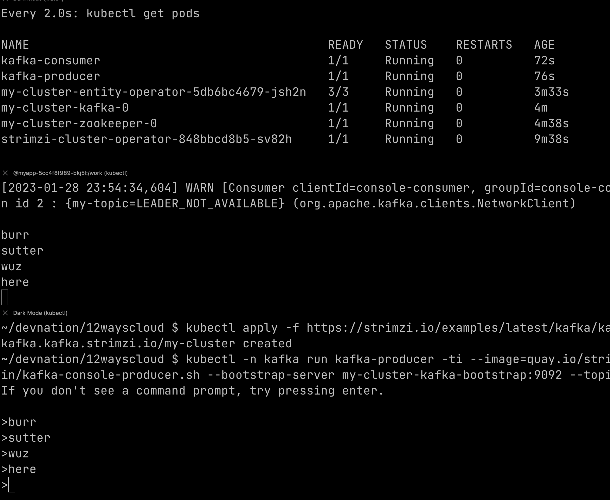

= Way 4: Kafka

https://strimzi.io/quickstarts/

----
kubectl create namespace kafka
kubectl config set-context --current --namespace=kafka
----

Install Strimzi Operator

----
kubectl create -f 'https://strimzi.io/install/latest?namespace=kafka' -n kafka
----

----
kubectl get crds | grep kafka
----

----
kubectl get crds | grep kafka
kafkabridges.kafka.strimzi.io                         2023-01-28T23:46:06Z
kafkaconnectors.kafka.strimzi.io                      2023-01-28T23:46:06Z
kafkaconnects.kafka.strimzi.io                        2023-01-28T23:46:06Z
kafkamirrormaker2s.kafka.strimzi.io                   2023-01-28T23:46:06Z
kafkamirrormakers.kafka.strimzi.io                    2023-01-28T23:46:06Z
kafkarebalances.kafka.strimzi.io                      2023-01-28T23:46:06Z
kafkas.kafka.strimzi.io                               2023-01-28T23:46:06Z
kafkatopics.kafka.strimzi.io                          2023-01-28T23:46:06Z
kafkausers.kafka.strimzi.io                           2023-01-28T23:46:06Z
----

----
kubectl get pods
NAME                                        READY   STATUS    RESTARTS   AGE
strimzi-cluster-operator-848bbcd8b5-sv82h   1/1     Running   0          72s
----

Create a Kafka Broker

----
kubectl apply -f https://strimzi.io/examples/latest/kafka/kafka-persistent-single.yaml -n kafka 
----

----
kubectl get pods
NAME                                          READY   STATUS    RESTARTS   AGE
my-cluster-entity-operator-5db6bc4679-jsh2n   3/3     Running   0          89s
my-cluster-kafka-0                            1/1     Running   0          116s
my-cluster-zookeeper-0                        1/1     Running   0          2m34s
strimzi-cluster-operator-848bbcd8b5-sv82h     1/1     Running   0          7m34s
----

Test Consumer
----
kubectl -n kafka run kafka-consumer -ti --image=quay.io/strimzi/kafka:0.33.0-kafka-3.3.2 --rm=true --restart=Never -- bin/kafka-console-consumer.sh --bootstrap-server my-cluster-kafka-bootstrap:9092 --topic my-topic --from-beginning
----

Test Producer
----
kubectl -n kafka run kafka-producer -ti --image=quay.io/strimzi/kafka:0.33.0-kafka-3.3.2 --rm=true --restart=Never -- bin/kafka-console-producer.sh --bootstrap-server my-cluster-kafka-bootstrap:9092 --topic my-topic
----

----
kubectl get kafkas
NAME         DESIRED KAFKA REPLICAS   DESIRED ZK REPLICAS   READY   WARNINGS
my-cluster   1                        1                     True
----

----
kubectl get kafkatopics
NAME                                                                                               CLUSTER      PARTITIONS   REPLICATION FACTOR   READY
consumer-offsets---84e7a678d08f4bd226872e5cdd4eb527fadc1c6a                                        my-cluster   50           1                    True
my-topic                                                                                           my-cluster   1            1                    True
strimzi-store-topic---effb8e3e057afce1ecf67c3f5d8e4e3ff177fc55                                     my-cluster   1            1                    True
strimzi-topic-operator-kstreams-topic-store-changelog---b75e702040b99be8a9263134de3507fc0cc4017b   my-cluster   1            1
----

