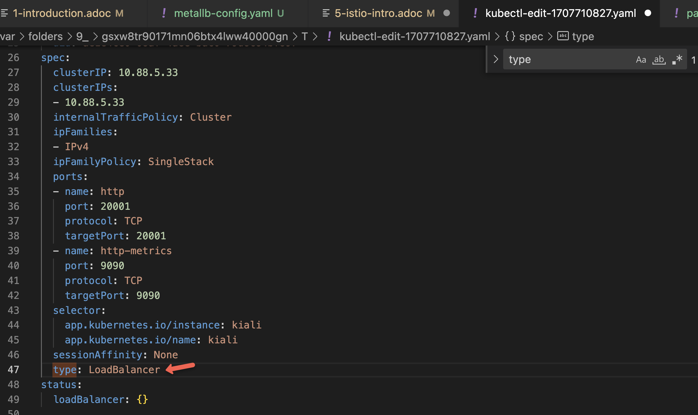
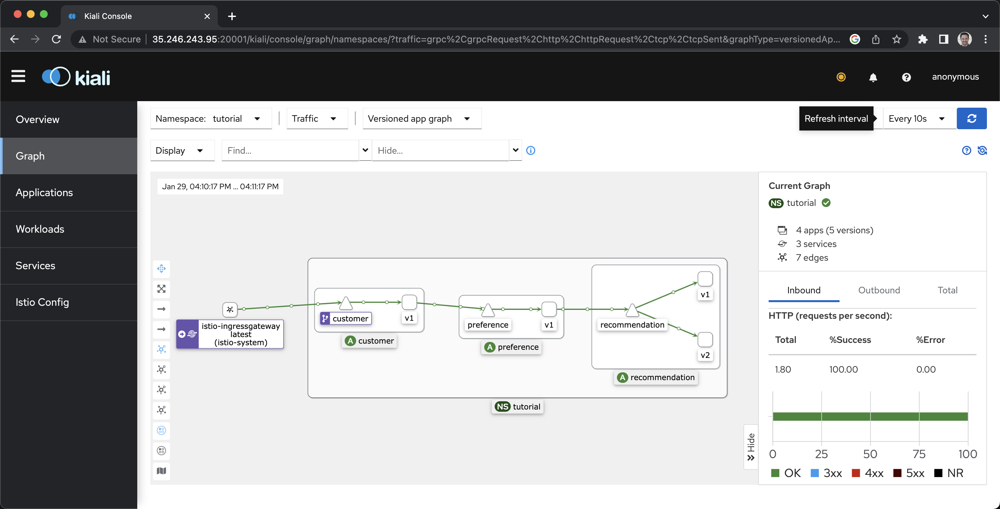
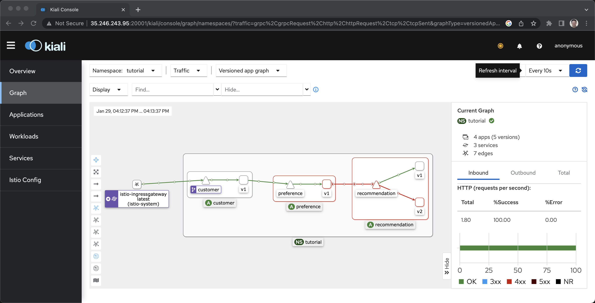
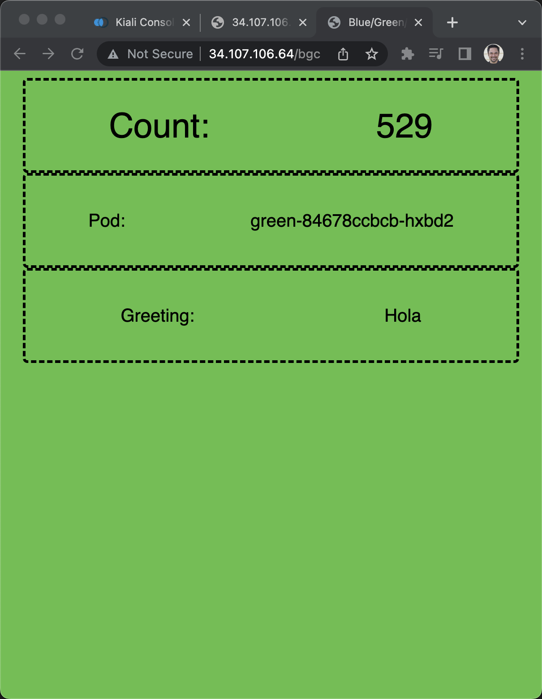

= Way 5: Istio

https://istio.io/latest/docs/setup/getting-started/

[.console-input]
[source,bash,subs="+macros,+attributes"]
----
gcloud container clusters list

export KUBECONFIG=/Users/burr/xKS/.kubeconfig/frankfurt-config

gcloud container clusters create frankfurt --zone europe-west3-a --num-nodes 4
----

----
kubectl get nodes
----

----
NAME                                       STATUS   ROLES    AGE   VERSION
gke-frankfurt-default-pool-f6e5f40a-2k7k   Ready    <none>   10m   v1.24.8-gke.2000
gke-frankfurt-default-pool-f6e5f40a-42bw   Ready    <none>   10m   v1.24.8-gke.2000
gke-frankfurt-default-pool-f6e5f40a-fhw8   Ready    <none>   10m   v1.24.8-gke.2000
gke-frankfurt-default-pool-f6e5f40a-rkz4   Ready    <none>   10m   v1.24.8-gke.2000
----

[.console-input]
[source,bash,subs="+macros,+attributes"]
----
curl -L https://istio.io/downloadIstio | sh -
----

OR

[.console-input]
[source,bash,subs="+macros,+attributes"]
----
curl -L https://istio.io/downloadIstio | ISTIO_VERSION=1.16.1 TARGET_ARCH=x86_64 sh -
----

[.console-input]
[source,bash,subs="+macros,+attributes"]
----
export PATH=/Users/burr/devnation/12wayscloud/istio-1.16.1/bin:$PATH
----

----
istioctl version
no running Istio pods in "istio-system"
1.16.1
----

[.console-input]
[source,bash,subs="+macros,+attributes"]
----
istioctl install --set profile=demo -y
----

[.console-input]
[source,bash,subs="+macros,+attributes"]
----
kubectl get crds | grep istio
----

----
authorizationpolicies.security.istio.io          2023-01-29T20:40:38Z
destinationrules.networking.istio.io             2023-01-29T20:40:38Z
envoyfilters.networking.istio.io                 2023-01-29T20:40:39Z
gateways.networking.istio.io                     2023-01-29T20:40:39Z
istiooperators.install.istio.io                  2023-01-29T20:40:39Z
peerauthentications.security.istio.io            2023-01-29T20:40:39Z
proxyconfigs.networking.istio.io                 2023-01-29T20:40:39Z
requestauthentications.security.istio.io         2023-01-29T20:40:39Z
serviceentries.networking.istio.io               2023-01-29T20:40:40Z
sidecars.networking.istio.io                     2023-01-29T20:40:40Z
telemetries.telemetry.istio.io                   2023-01-29T20:40:40Z
virtualservices.networking.istio.io              2023-01-29T20:40:40Z
wasmplugins.extensions.istio.io                  2023-01-29T20:40:41Z
workloadentries.networking.istio.io              2023-01-29T20:40:41Z
workloadgroups.networking.istio.io               2023-01-29T20:40:41Z
----

[.console-input]
[source,bash,subs="+macros,+attributes"]
----
kubectl create namespace tutorial
kubectl config set-context --current --namespace=tutorial
kubectl label namespace tutorial istio-injection=enabled
----

[.console-input]
[source,bash,subs="+macros,+attributes"]
----
git clone https://github.com/redhat-scholars/istio-tutorial
----

----
watch kubectl get pods
----

[.console-input]
[source,bash,subs="+macros,+attributes"]
----
kubectl apply -f istio-tutorial/customer/kubernetes/Deployment.yml -n tutorial
kubectl apply -f istio-tutorial/customer/kubernetes/Service.yml -n tutorial
kubectl apply -f istio-tutorial/preference/kubernetes/Deployment.yml -n tutorial
kubectl apply -f istio-tutorial/preference/kubernetes/Service.yml -n tutorial
kubectl apply -f istio-tutorial/recommendation/kubernetes/Deployment.yml -n tutorial
kubectl apply -f istio-tutorial/recommendation/kubernetes/Service.yml -n tutorial
----

----
kubectl get pods
NAME                                 READY   STATUS    RESTARTS   AGE
customer-5588bcb99d-rtm72            2/2     Running   0          34s
preference-v1-6c4b658c57-bhxwm       2/2     Running   0          40s
recommendation-v1-5595cf5f84-c8j9g   2/2     Running   0          42s
----

----
kubectl get services
NAME             TYPE        CLUSTER-IP      EXTERNAL-IP   PORT(S)    AGE
customer         ClusterIP   10.96.214.85    <none>        8080/TCP   3m43s
preference       ClusterIP   10.96.161.173   <none>        8080/TCP   2m27s
recommendation   ClusterIP   10.96.131.65    <none>        8080/TCP   119s
----

[.console-input]
[source,bash,subs="+macros,+attributes"]
----
kubectl create -f istio-tutorial/customer/kubernetes/Gateway.yml -n tutorial
----

----
kubectl get vs
NAME               GATEWAYS               HOSTS   AGE
customer-gateway   ["customer-gateway"]   ["*"]   4s
----

----
kubectl get services -n istio-system
----

----
NAME                   TYPE           CLUSTER-IP    EXTERNAL-IP     PORT(S)                                                                      AGE
istio-egressgateway    ClusterIP      10.88.1.247   <none>          80/TCP,443/TCP                                                               5m25s
istio-ingressgateway   LoadBalancer   10.88.13.58   34.107.106.64   15021:30130/TCP,80:32126/TCP,443:30886/TCP,31400:31959/TCP,15443:32132/TCP   5m25s
istiod                 ClusterIP      10.88.14.76   <none>          15010/TCP,15012/TCP,443/TCP,15014/TCP                                        5m35s
----

[.console-input]
[source,bash,subs="+macros,+attributes"]
----
GATEWAY_IP=$(kubectl -n istio-system get service istio-ingressgateway -o jsonpath="{.status.loadBalancer.ingress[0].ip}")
echo $GATEWAY_IP
----

[.console-input]
[source,bash,subs="+macros,+attributes"]
----
curl $GATEWAY_IP/customer
----

----
customer => preference => recommendation v1 from 'recommendation-v1-64f475959-jjb47': 1
----

[.console-input]
[source,bash,subs="+macros,+attributes"]
----
while true
do curl $GATEWAY_IP/customer
sleep .3
done
----

----
customer => preference => recommendation v1 from 'recommendation-v1-64f475959-jjb47': 2
customer => preference => recommendation v1 from 'recommendation-v1-64f475959-jjb47': 3
customer => preference => recommendation v1 from 'recommendation-v1-64f475959-jjb47': 4
----

Recommendation v2
[.console-input]
[source,bash,subs="+macros,+attributes"]
----
kubectl apply -f istio-tutorial/recommendation/kubernetes/Deployment-v2.yml -n tutorial
----

----
customer => preference => recommendation v1 from 'recommendation-v1-64f475959-jjb47': 39
customer => preference => recommendation v2 from 'recommendation-v2-776b64fff5-lgsr9': 1
customer => preference => recommendation v1 from 'recommendation-v1-64f475959-jjb47': 40
customer => preference => recommendation v2 from 'recommendation-v2-776b64fff5-lgsr9': 2
customer => preference => recommendation v2 from 'recommendation-v2-776b64fff5-lgsr9': 3
customer => preference => recommendation v1 from 'recommendation-v1-64f475959-jjb47': 41
----

v2 only
[.console-input]
[source,bash,subs="+macros,+attributes"]
----
kubectl create -f istio-tutorial/istiofiles/destination-rule-recommendation-v1-v2.yml -n tutorial
kubectl create -f istio-tutorial/istiofiles/virtual-service-recommendation-v2.yml -n tutorial
----

----
customer => preference => recommendation v1 from 'recommendation-v1-64f475959-jjb47': 46
customer => preference => recommendation v2 from 'recommendation-v2-776b64fff5-lgsr9': 11
customer => preference => recommendation v2 from 'recommendation-v2-776b64fff5-lgsr9': 12
customer => preference => recommendation v2 from 'recommendation-v2-776b64fff5-lgsr9': 13
----

[.console-input]
[source,bash,subs="+macros,+attributes"]
----
export KUBE_EDITOR="code -w"
----

Switch to v1

[.console-input]
[source,bash,subs="+macros,+attributes"]
----
kubectl edit vs recommendation
----

== Kiali

https://istio.io/latest/docs/ops/integrations/kiali/#installation

[.console-input]
[source,bash,subs="+macros,+attributes"]
----
kubectl apply -f istio-1.16.1/samples/addons/prometheus.yaml
kubectl apply -f istio-1.16.1/samples/addons/kiali.yaml
----

----
kubectl get services kiali -n istio-system
NAME    TYPE        CLUSTER-IP   EXTERNAL-IP   PORT(S)              AGE
kiali   ClusterIP   10.88.5.33   <none>        20001/TCP,9090/TCP   32s
----

Switch it to LoadBalancer

[.console-input]
[source,bash,subs="+macros,+attributes"]
----
kubectl edit service kiali -n istio-system
----

----
kubectl get services kiali -n istio-system
NAME    TYPE           CLUSTER-IP   EXTERNAL-IP     PORT(S)                          AGE
kiali   LoadBalancer   10.88.5.33   35.246.243.95   20001:30212/TCP,9090:30518/TCP   3m29s
----

[.console-input]
[source,bash,subs="+macros,+attributes"]
----
KIALI_IP=$(kubectl -n istio-system get service kiali -o jsonpath="{.status.loadBalancer.ingress[0].ip}")
echo $KIALI_IP
open http://$KIALI_IP:20001
----

Injure Recommendation v2

[.console-input]
[source,bash,subs="+macros,+attributes"]
----
kubectl exec -it -n tutorial $(kubectl get pods -n tutorial|grep recommendation-v2|awk '{ print $1 }'|head -1) -c recommendation /bin/bash
----

[.console-input]
[source,bash,subs="+macros,+attributes"]
----
curl localhost:8080/misbehave
----

----
customer => preference => recommendation v1 from 'recommendation-v1-64f475959-jjb47': 882
customer => preference => recommendation v1 from 'recommendation-v1-64f475959-jjb47': 883
customer => preference => recommendation v1 from 'recommendation-v1-64f475959-jjb47': 884
customer => preference => recommendation v1 from 'recommendation-v1-64f475959-jjb47': 885
----

== Blue/Green/Canary

https://github.com/redhat-developer-demos/blue-green-canary

----
git clone https://github.com/redhat-developer-demos/blue-green-canary
----

----
kubectl create namespace one
kubectl config set-context --current --namespace=one
kubectl label namespace one istio-injection=enabled
----

----
kubectl apply -f blue-green-canary/src/main/kubernetes/Deployment_blue.yml -n one
kubectl apply -f blue-green-canary/src/main/kubernetes/Deployment_green.yml -n one
kubectl apply -f blue-green-canary/src/main/kubernetes/Deployment_canary.yml -n one
kubectl create -f blue-green-canary/src/main/kubernetes/Service.yml -n one
----

----
kubectl apply -f bgc-gateway.yml -n one
kubectl apply -f bgc-virtualservice-default.yml -n one
kubectl apply -f bgc-destination-rule.yml
----

----
GATEWAY_IP=$(kubectl -n istio-system get service istio-ingressgateway -o jsonpath="{.status.loadBalancer.ingress[0].ip}")
echo $GATEWAY_IP
open http://$GATEWAY_IP/bgc
----

----
while true
do curl $GATEWAY_IP/api
sleep .3
echo ""
done
----

----
kubectl replace -f bgc-virtual-service-green.yml
----

----
{"msgCount" :519, "hello" : "Hola", "pod" : "green-84678ccbcb-bzkwn", "useragent" : "curl/7.85.0", "color" : "#5bbf45"}
{"msgCount" :519, "hello" : "Hola", "pod" : "green-84678ccbcb-hxbd2", "useragent" : "curl/7.85.0", "color" : "#5bbf45"}
{"msgCount" :519, "hello" : "Hola", "pod" : "green-84678ccbcb-bzkwn", "useragent" : "curl/7.85.0", "color" : "#5bbf45"}
{"msgCount" :520, "hello" : "Hola", "pod" : "green-84678ccbcb-bzkwn", "useragent" : "curl/7.85.0", "color" : "#5bbf45"}
----

----
kubectl replace -f bgc-virtual-service-blue.yml
----

----
kubectl replace -f bgc-virtual-service-canary.yml
----

----
kubectl replace -f bgc-virtual-service-default.yml
----

== Clean

Wipe the GKE cluster

[.console-input]
[source,bash,subs="+macros,+attributes"]
----
gcloud container clusters delete frankfurt --zone europe-west3-a
----