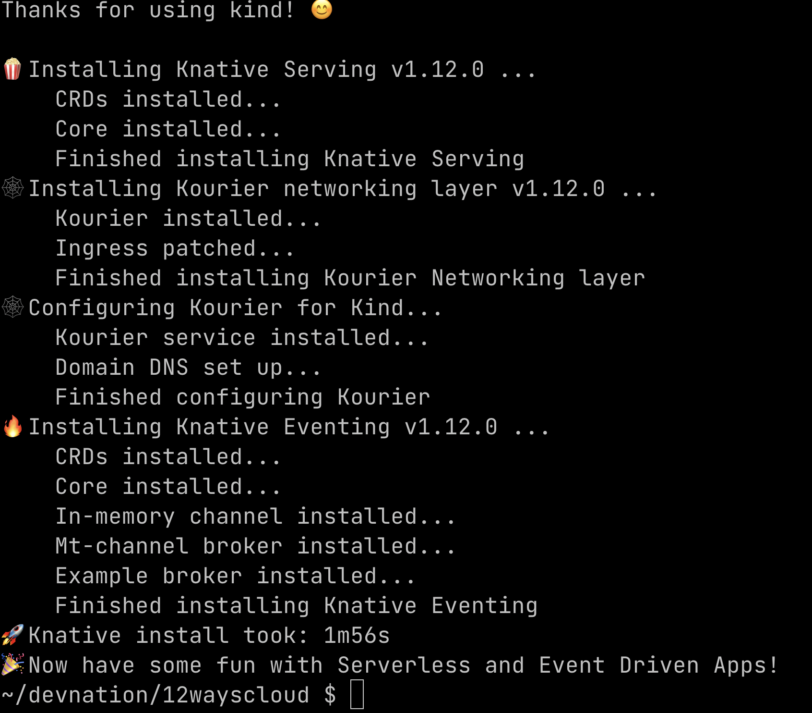
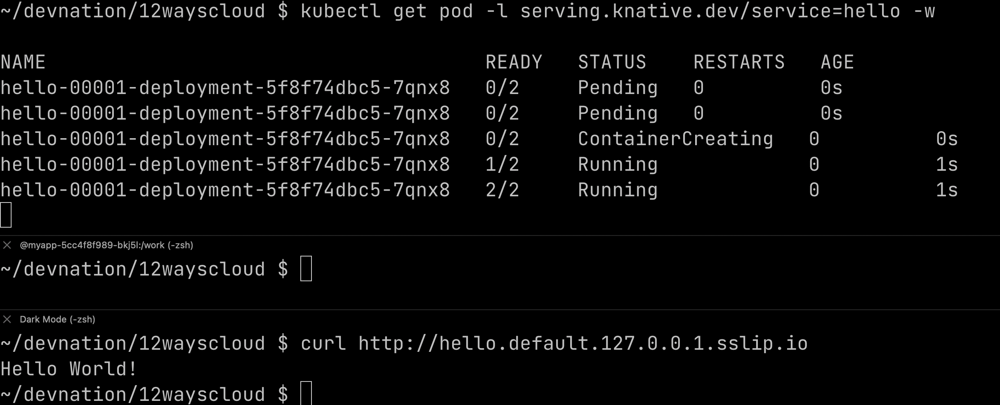
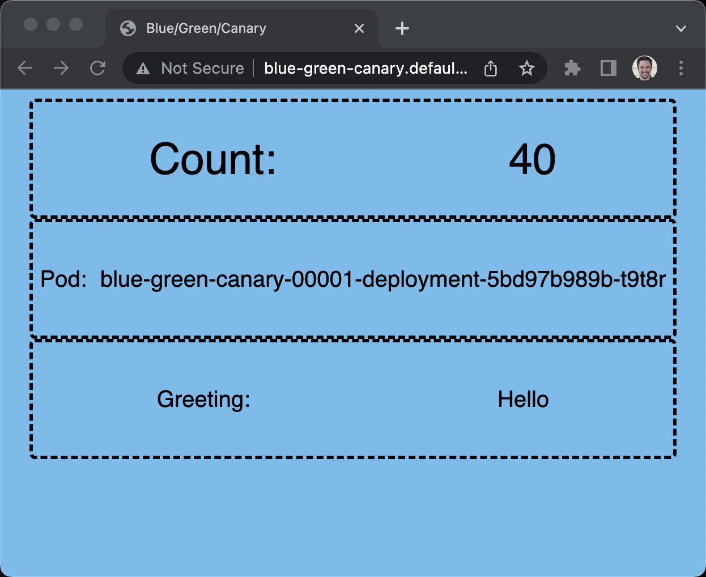
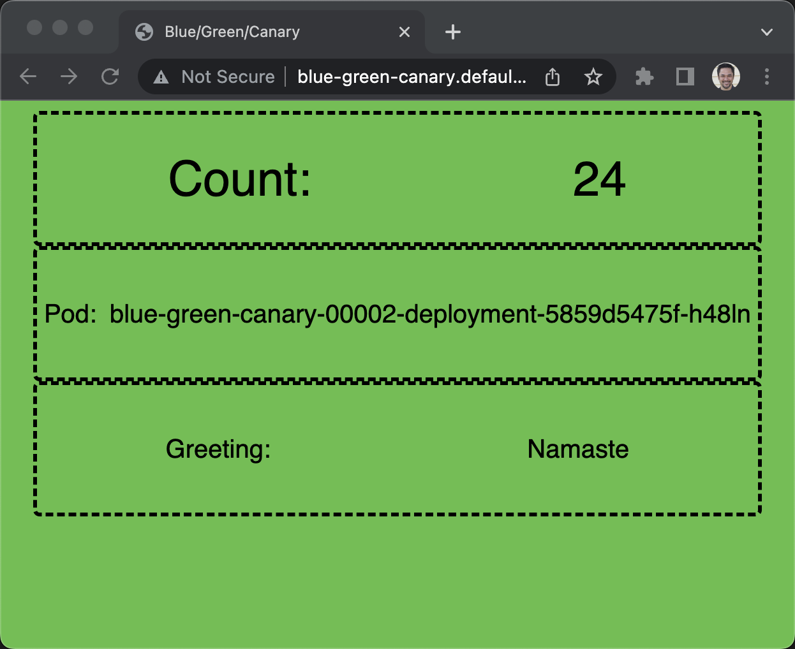
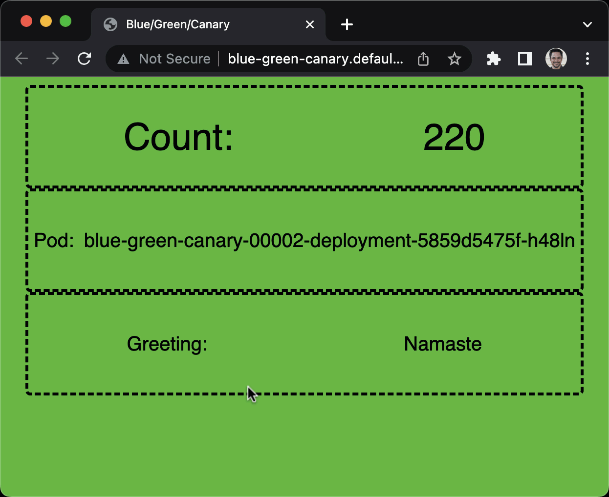
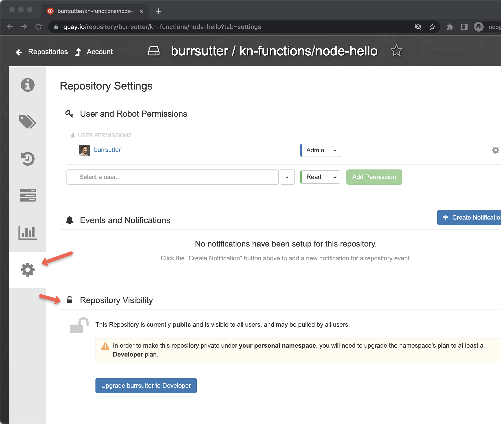

= Way 7: Knative Serving

Scale-to-zero for HTTP

Function as a Service

== Installation

https://knative.dev/docs/getting-started/quickstart-install/#before-you-begin

https://redhat-developer-demos.github.io/knative-tutorial/knative-tutorial/setup/setup.html

We will be using the Knative Quickstart that creates its own KinD cluster

----
brew install knative/client/kn
----

----
kn version
----

----
Version:      v1.12.0
Build Date:   2023-10-25 15:45:39
Git Revision: ae357368
Supported APIs:
* Serving
  - serving.knative.dev/v1 (knative-serving v1.12.0)
* Eventing
  - sources.knative.dev/v1 (knative-eventing v1.12.0)
  - eventing.knative.dev/v1 (knative-eventing v1.12.0)
----

----
brew install knative-sandbox/kn-plugins/quickstart
----

----
export KIND_HOME=~/devnation/12wayscloud;
export PATH=$KIND_HOME/bin:$PATH
export KUBECONFIG=$KIND_HOME/.kube/config
export KUBE_EDITOR="code -w"
----

This next command starts a KinD cluster specifically for Knative usage

----
kn-quickstart kind
----

----
kind get clusters
----

----
kubectl get nodes
----

----
kubectl cluster-info
----

----
Kubernetes control plane is running at https://127.0.0.1:62081
CoreDNS is running at https://127.0.0.1:62081/api/v1/namespaces/kube-system/services/kube-dns:dns/proxy

To further debug and diagnose cluster problems, use 'kubectl cluster-info dump'.
----

----
kubectl get pods -A
----

----
NAMESPACE            NAME                                            READY   STATUS    RESTARTS   AGE
knative-eventing     eventing-controller-79547fd7f4-ddd72            1/1     Running   0          7m35s
knative-eventing     eventing-webhook-8458d5898c-9vk6w               1/1     Running   0          7m35s
knative-eventing     imc-controller-6d55d956f-pdspl                  1/1     Running   0          7m4s
knative-eventing     imc-dispatcher-895bfd847-nvxtz                  1/1     Running   0          7m4s
knative-eventing     mt-broker-controller-6754559b7c-82jpq           1/1     Running   0          6m56s
knative-eventing     mt-broker-filter-7475984f8-m7vbj                1/1     Running   0          6m56s
knative-eventing     mt-broker-ingress-6786db9bfd-l8gwr              1/1     Running   0          6m56s
knative-serving      activator-8c964665f-6fpdm                       1/1     Running   0          8m5s
knative-serving      autoscaler-5fc869cc5-d6qmc                      1/1     Running   0          8m5s
knative-serving      controller-5946d56bc-s7th5                      1/1     Running   0          8m5s
knative-serving      net-kourier-controller-d46684575-knhr9          1/1     Running   0          7m56s
knative-serving      webhook-75d84c68b9-798ws                        1/1     Running   0          8m5s
kourier-system       3scale-kourier-gateway-6f84654dc4-wrhrn         1/1     Running   0          7m56s
kube-system          coredns-787d4945fb-7bgnn                        1/1     Running   0          8m12s
kube-system          coredns-787d4945fb-nr7xq                        1/1     Running   0          8m12s
kube-system          etcd-knative-control-plane                      1/1     Running   0          8m29s
kube-system          kindnet-wpqhf                                   1/1     Running   0          8m12s
kube-system          kube-apiserver-knative-control-plane            1/1     Running   0          8m27s
kube-system          kube-controller-manager-knative-control-plane   1/1     Running   0          8m29s
kube-system          kube-proxy-7gfkz                                1/1     Running   0          8m12s
kube-system          kube-scheduler-knative-control-plane            1/1     Running   0          8m27s
local-path-storage   local-path-provisioner-6bd6454576-hbcdf         1/1     Running   0          8m12s
----

----
kubectl get crds
----

----
NAME                                                  CREATED AT
NAME                                                  CREATED AT
apiserversources.sources.knative.dev                  2023-11-05T21:07:57Z
brokers.eventing.knative.dev                          2023-11-05T21:07:57Z
certificates.networking.internal.knative.dev          2023-11-05T21:07:28Z
channels.messaging.knative.dev                        2023-11-05T21:07:57Z
clusterdomainclaims.networking.internal.knative.dev   2023-11-05T21:07:28Z
configurations.serving.knative.dev                    2023-11-05T21:07:28Z
containersources.sources.knative.dev                  2023-11-05T21:07:57Z
domainmappings.serving.knative.dev                    2023-11-05T21:07:28Z
eventtypes.eventing.knative.dev                       2023-11-05T21:07:57Z
images.caching.internal.knative.dev                   2023-11-05T21:07:28Z
ingresses.networking.internal.knative.dev             2023-11-05T21:07:28Z
inmemorychannels.messaging.knative.dev                2023-11-05T21:08:32Z
metrics.autoscaling.internal.knative.dev              2023-11-05T21:07:28Z
parallels.flows.knative.dev                           2023-11-05T21:07:57Z
pingsources.sources.knative.dev                       2023-11-05T21:07:57Z
podautoscalers.autoscaling.internal.knative.dev       2023-11-05T21:07:28Z
revisions.serving.knative.dev                         2023-11-05T21:07:28Z
routes.serving.knative.dev                            2023-11-05T21:07:28Z
sequences.flows.knative.dev                           2023-11-05T21:07:57Z
serverlessservices.networking.internal.knative.dev    2023-11-05T21:07:28Z
services.serving.knative.dev                          2023-11-05T21:07:28Z
sinkbindings.sources.knative.dev                      2023-11-05T21:07:57Z
subscriptions.messaging.knative.dev                   2023-11-05T21:07:57Z
triggers.eventing.knative.dev                         2023-11-05T21:07:57Z
----

----
kubectl api-resources | grep knative
----

----
metrics                                           autoscaling.internal.knative.dev/v1alpha1   true         Metric
podautoscalers                    kpa,pa          autoscaling.internal.knative.dev/v1alpha1   true         PodAutoscaler
images                                            caching.internal.knative.dev/v1alpha1       true         Image
brokers                                           eventing.knative.dev/v1                     true         Broker
eventtypes                                        eventing.knative.dev/v1beta2                true         EventType
triggers                                          eventing.knative.dev/v1                     true         Trigger
parallels                                         flows.knative.dev/v1                        true         Parallel
sequences                                         flows.knative.dev/v1                        true         Sequence
channels                          ch              messaging.knative.dev/v1                    true         Channel
inmemorychannels                  imc             messaging.knative.dev/v1                    true         InMemoryChannel
subscriptions                     sub             messaging.knative.dev/v1                    true         Subscription
certificates                      kcert           networking.internal.knative.dev/v1alpha1    true         Certificate
clusterdomainclaims               cdc             networking.internal.knative.dev/v1alpha1    false        ClusterDomainClaim
ingresses                         kingress,king   networking.internal.knative.dev/v1alpha1    true         Ingress
serverlessservices                sks             networking.internal.knative.dev/v1alpha1    true         ServerlessService
configurations                    config,cfg      serving.knative.dev/v1                      true         Configuration
domainmappings                    dm              serving.knative.dev/v1beta1                 true         DomainMapping
revisions                         rev             serving.knative.dev/v1                      true         Revision
routes                            rt              serving.knative.dev/v1                      true         Route
services                          kservice,ksvc   serving.knative.dev/v1                      true         Service
apiserversources                                  sources.knative.dev/v1                      true         ApiServerSource
containersources                                  sources.knative.dev/v1                      true         ContainerSource
pingsources                                       sources.knative.dev/v1                      true         PingSource
sinkbindings                                      sources.knative.dev/v1                      true         SinkBinding
----

== Services - kn

----
kn service create hello \
--image gcr.io/knative-samples/helloworld-go \
--port 8080 \
--env TARGET=World
----

----
Creating service 'hello' in namespace 'default':

  0.014s The Route is still working to reflect the latest desired specification.
  0.024s ...
  0.034s Configuration "hello" is waiting for a Revision to become ready.
 14.679s ...
 14.708s Ingress has not yet been reconciled.
 14.747s Waiting for load balancer to be ready
 14.936s Ready to serve.

Service 'hello' created to latest revision 'hello-00001' is available at URL:
http://hello.default.127.0.0.1.sslip.io
----

----
watch kubectl get pods
----

----
curl http://hello.default.127.0.0.1.sslip.io
----

----
Hello World!
----

----
kn service list
----

----
NAME    URL                                       LATEST        AGE   CONDITIONS   READY   REASON
hello   http://hello.default.127.0.0.1.sslip.io   hello-00001   88s   3 OK / 3     True
----

----
echo "Accessing URL $(kn service describe hello -o url)"
curl "$(kn service describe hello -o url)"
----

----
Hello World!
----

2nd Terminal

----
kubectl get pod -l serving.knative.dev/service=hello -w
----

----
NAME                                      READY   STATUS    RESTARTS   AGE
hello-00001-deployment-5f8f74dbc5-vqtqk   2/2     Running   0          33s
----

----
NAME                                      READY   STATUS        RESTARTS   AGE
hello-00001-deployment-5f8f74dbc5-vqtqk   2/2     Terminating   0          72s
----

----
kubectl get pods
----

Eventually no pods 

----
No resources found in default namespace.
----

Run another test of the endpoint
----
curl http://hello.default.127.0.0.1.sslip.io
----

----
kn service list
----

----
NAME    URL                                       LATEST        AGE     CONDITIONS   READY   REASON
hello   http://hello.default.127.0.0.1.sslip.io   hello-00001   3m10s   3 OK / 3     True
----

----
kn service create greeter \
  --image=quay.io/rhdevelopers/knative-tutorial-greeter:quarkus
----

----
kn service list
----

----
NAME      URL                                         LATEST          AGE    CONDITIONS   READY   REASON
greeter   http://greeter.default.127.0.0.1.sslip.io   greeter-00001   39m    3 OK / 3     True
hello     http://hello.default.127.0.0.1.sslip.io     hello-00001     156m   3 OK / 3     True
----

----
kn service describe greeter -o url
----

----
curl $(kn service describe greeter -o url)
curl $(kn service describe greeter -o url)
----

----
Hi  greeter => '9861675f8845' : 1
Hi  greeter => '9861675f8845' : 2
----

https://github.com/redhat-developer-demos/knative-tutorial/blob/master/apps/greeter/java/quarkus/src/main/java/com/redhat/developer/demos/GreetingService.java#L37

----
kn service delete greeter
kn service delete hello
----

== Side By Side

[.console-input]
[source,bash,subs="+macros,+attributes"]
----
kubectl create namespace sidebyside
kubectl config set-context --current --namespace=sidebyside
----

----
kn service create pythoned \
  --image=docker.io/burrsutter/pythoned:1.0.0
----

----
curl $(kn service describe pythoned -o url)
----

----
kn service create noded \
  --image=docker.io/burrsutter/noded:1.0.1
----

----
curl $(kn service describe noded -o url)
----

----
kn service create quarked \
  --image=docker.io/burrsutter/quarked:1.0.2
----

----
curl $(kn service describe quarked -o url)
curl $(kn service describe noded -o url)
curl $(kn service describe pythoned -o url)
----

----
kubectl get kservice
NAME       URL                                             LATESTCREATED    LATESTREADY      READY   REASON
noded      http://noded.sidebyside.127.0.0.1.sslip.io      noded-00001      noded-00001      True
pythoned   http://pythoned.sidebyside.127.0.0.1.sslip.io   pythoned-00001   pythoned-00001   True
quarked    http://quarked.sidebyside.127.0.0.1.sslip.io    quarked-00001    quarked-00001    True
----

----
watch kubectl get deployments
NAME                        READY   UP-TO-DATE   AVAILABLE   AGE
noded-00001-deployment      0/0     0            0           3m52s
pythoned-00001-deployment   0/0     0            0           3m58s
quarked-00001-deployment    0/0     0            0           3m46s
----

----
curl $(kn service describe quarked -o url)
curl $(kn service describe noded -o url)
curl $(kn service describe pythoned -o url)
----

Clean up sidebyside
----
kubectl delete namespace sidebyside
----

== Traffic Spliting

[.console-input]
[source,bash,subs="+macros,+attributes"]
----
kubectl create namespace splitting
kubectl config set-context --current --namespace=splitting
----

----
git clone https://github.com/redhat-developer-demos/knative-tutorial
export KNATIVE_TUTORIAL_HOME=~/devnation/12wayscloud/knative-tutorial
----

Deploy Blue

----
kubectl apply -f $KNATIVE_TUTORIAL_HOME/serving/colors-service-blue.yaml
----

----
open $(kn service describe blue-green-canary -o url)
----

----
kn revision list
----

----
NAME                      SERVICE             TRAFFIC   TAGS   GENERATION   AGE     CONDITIONS   READY   REASON
blue-green-canary-00001   blue-green-canary   100%             1            2m49s   4 OK / 4     True
----

Deploy Green

----
kubectl apply -f $KNATIVE_TUTORIAL_HOME/serving/colors-service-green.yaml
----

----
watch kn revision list
----

----
NAME                      SERVICE             TRAFFIC   TAGS   GENERATION   AGE     CONDITIONS   READY   REASON
blue-green-canary-00002   blue-green-canary   100%             2            14s     4 OK / 4     True
blue-green-canary-00001   blue-green-canary                    1            7m31s   4 OK / 4     True
----

Flip to Blue

----
kn service update blue-green-canary \
--traffic blue-green-canary-00001=100
----

Green

----
kn service update blue-green-canary \
--traffic blue-green-canary-00002=100
----

Deploy Canary

----
kubectl apply -f $KNATIVE_TUTORIAL_HOME/serving/colors-service-canary.yaml
----

Give Canary a wee bit of traffic

----
kn service update blue-green-canary \
--traffic blue-green-canary-00003=10 \
--traffic blue-green-canary-00002=45 \
--traffic blue-green-canary-00001=45 
----

----
kn revision list
----

----
NAME                      SERVICE             TRAFFIC   TAGS   GENERATION   AGE    CONDITIONS   READY   REASON
blue-green-canary-00003   blue-green-canary   10%              3            7m5s   3 OK / 4     True
blue-green-canary-00002   blue-green-canary   45%              2            11m    4 OK / 4     True
blue-green-canary-00001   blue-green-canary   45%              1            18m    4 OK / 4     True
----

Clean

----
 kn service delete blue-green-canary
----

== Functions with func

https://knative.dev/docs/functions/

https://cloud-native.slack.com/archives/C04LKEZUXEE

Install `func`

----
brew tap knative-sandbox/kn-plugins
brew install func
----

----
func version
v0.38.0-99-gcd0bc6ae
----

----
func create -l node node-hello-func
----

----
export FUNC_REGISTRY=docker.io/burrsutter
----

----
cd node-hello-func
func run
----

----
docker ps
----

----
docker images
----

This runs 

----
   🙌 Function image built: docker.io/burrsutter/node-hello-func:latest
Function already built.  Use --build to force a rebuild.
Function started on port 8080
{"level":30,"time":1674945157347,"pid":38,"hostname":"86d45018d527","msg":"Server listening at http://[::]:8080"}
----

2nd Terminal

----
cd node-hello-func
func invoke
----

----
Received response
{"message":"Hello World"}%
----

----
func invoke --data "{\"message\":\"Hola Burr\"}"
----

----
{"message":"Hola Burr"}
----

Modify the code of index.js

----
const handle = async (context, body) => {
  console.log("Hola, Bonjour, Namaste");
  // context.log.info("query", context.query);
  // context.log.info("body", body);

  // If the request is an HTTP POST, the context will contain the request body
  if (context.method === 'POST') {
    return { body };
  } else if (context.method === 'GET') {
  // If the request is an HTTP GET, the context will include a query string, if it exists
  return {
      query: context.query,
    }
  } else {
    return { statusCode: 405, statusMessage: 'Method not allowed' };
  }
}
----

Cntrl-C 

----
func run
----

It is not yet a Knative Service

----
kn service list
----

----
kubectl get ksvc
----

Cntrl-C 

----
docker login
----

----
func deploy
----

If using quay.io which defaults to private repos you might see the following message

----
Error: your function image is unreachable. It is possible that your docker registry is private. If so, make sure you have set up pull secrets https://knative.dev/docs/developer/serving/deploying-from-private-registry
----

----
kubectl get ksvc
----

----
NAME              URL                                                 LATESTCREATED           LATESTREADY             READY   REASON
node-hello-func   http://node-hello-func.default.127.0.0.1.sslip.io   node-hello-func-00001   node-hello-func-00001   True
----

----
curl $(kn service describe node-hello-func -o url)
----

----
{"query":{}}
----

----
stern node-hello
----

----
curl -H 'Content-Type: application/json' \
     -d '{ "my":"stuff","happens":"here", "id": 1}' \
     -X POST \
     $(kn service describe node-hello-func -o url)
----

----
{"my":"stuff","happens":"here","id":1}
----

To just deploy without a build

----
func deploy --build false
----

To clean out that Function

----
func delete 
----

----
kubectl get ksvc
No resources found in default namespace.
----

----
kn service list
No services found.
----

== Clean Up

----
kind delete cluster --name knative
----

----
rm -rf node-hello-func
----

----
docker ps
----