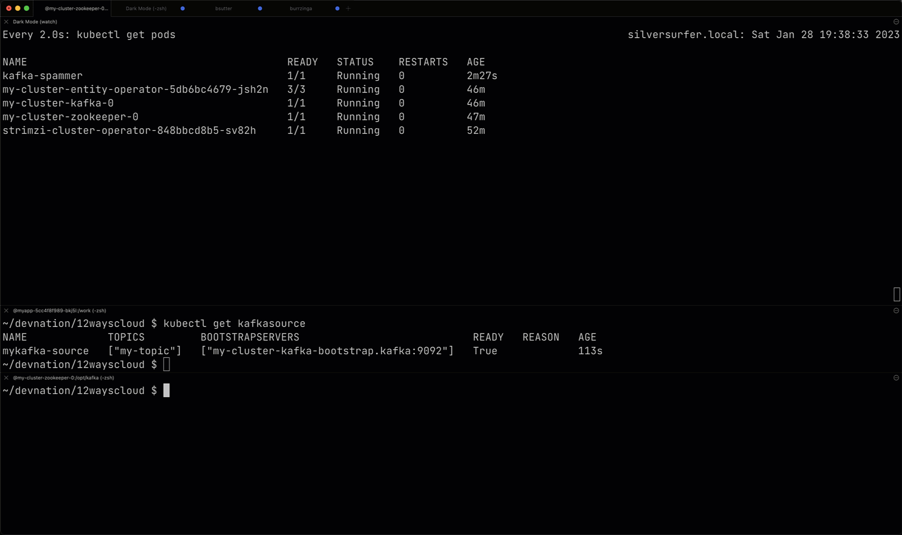

= Way 8: Knative Eventing

https://redhat-developer-demos.github.io/knative-tutorial/knative-tutorial/eventing/index.html

https://knative.dev/docs/getting-started/getting-started-eventing/

Assumes you ran the Knative Serving steps

Just re-creating the cluster for a cleaner place to play

[.console-input]
[source,bash,subs="+macros,+attributes"]
----
kn quickstart kind
----

Sources to Sinks

[.console-input]
[source,bash,subs="+macros,+attributes"]
----
kubectl api-resources --api-group='sources.knative.dev'
----

Out of the box Sources

----
NAME               SHORTNAMES   APIVERSION               NAMESPACED   KIND
apiserversources                sources.knative.dev/v1   true         ApiServerSource
containersources                sources.knative.dev/v1   true         ContainerSource
pingsources                     sources.knative.dev/v1   true         PingSource
sinkbindings                    sources.knative.dev/v1   true         SinkBinding
----

----
kubectl get crds | grep source
apiserversources.sources.knative.dev                  2023-01-28T21:28:30Z
containersources.sources.knative.dev                  2023-01-28T21:28:30Z
pingsources.sources.knative.dev                       2023-01-28T21:28:30Z
sinkbindings.sources.knative.dev                      2023-01-28T21:28:30Z
----

Create a Sink

[.console-input]
[source,bash,subs="+macros,+attributes"]
----
kn service create eventinghello \
  --concurrency-target=1 \
  --image=quay.io/rhdevelopers/eventinghello:0.0.2
----

[.console-input]
[source,bash,subs="+macros,+attributes"]
----
kn service list
----

----
NAME            URL                                               LATEST                AGE   CONDITIONS   READY   REASON
eventinghello   http://eventinghello.default.127.0.0.1.sslip.io   eventinghello-00001   31s   3 OK / 3     True
----

[.console-input]
[source,bash,subs="+macros,+attributes"]
----
stern eventinghello
----

Create a Source

[.console-input]
[source,bash,subs="+macros,+attributes"]
----
kn source ping create eventinghello-ping-source \
  --schedule "*/2 * * * *" \
  --data '{"message": "Thanks for doing Knative Tutorial"}' \
  --sink ksvc:eventinghello
----

[.console-input]
[source,bash,subs="+macros,+attributes"]
----
kubectl get pingsource
----

----
NAME                        SINK                                             SCHEDULE      AGE   READY   REASON
eventinghello-ping-source   http://eventinghello.default.svc.cluster.local   */2 * * * *   46s   True
----

and in the Stern terminal

----
eventinghello-00001-deployment-8d6d5fc68-hd59p user-container 2023-01-28 23:10:12,975 INFO  [eventing-hello] (executor-thread-1) POST:{"message": "Thanks for doing Knative Tutorial"}
----

And the ping interval is just long enough that the Knative Service will scale-to-zero for just a brief moment before scaling-from-zero again

https://youtu.be/kSZZr2mWkqk

Clean

[.console-input]
[source,bash,subs="+macros,+attributes"]
----
kubectl delete pingsource eventinghello-ping-source
kn service delete eventinghello
----

== Kafka & Knative

Follow the steps in 4-kafka.adoc to configure a Kafka inside your KinD cluster

More information at 

https://knative.dev/docs/eventing/sources/kafka-source/#optional-create-a-kafka-topic

and 

https://github.com/burrsutter/knative-kafka

https://redhat-developer-demos.github.io/knative-tutorial/knative-tutorial/advanced/eventing-with-kafka.html

[.console-input]
[source,bash,subs="+macros,+attributes"]
----
kubectl get kafkas
NAME         DESIRED KAFKA REPLICAS   DESIRED ZK REPLICAS   READY   WARNINGS
my-cluster   1                        1                     True
----

[.console-input]
[source,bash,subs="+macros,+attributes"]
----
kubectl delete kafkatopic my-topic
----

[.console-input]
[source,bash,subs="+macros,+attributes"]
----
cat <<EOF | kubectl apply -f -
apiVersion: kafka.strimzi.io/v1beta2
kind: KafkaTopic
metadata:
  name: my-topic
  labels:
    strimzi.io/cluster: my-cluster
    easy: find
spec:
  partitions: 10 
  replicas: 1
EOF
----

[.console-input]
[source,bash,subs="+macros,+attributes"]
----
kubectl get kafkatopics -l easy=find
----

[.console-output]
[source,bash,subs="+macros,+attributes"]
----
NAME       CLUSTER      PARTITIONS   REPLICATION FACTOR   READY
my-topic   my-cluster   10           1                    True
----

[.console-output]
[source,bash,subs="+macros,+attributes"]
----
kubectl get crds | grep sources
----

----
apiserversources.sources.knative.dev                  2023-01-28T23:34:35Z
containersources.sources.knative.dev                  2023-01-28T23:34:35Z
pingsources.sources.knative.dev                       2023-01-28T23:34:35Z
sinkbindings.sources.knative.dev                      2023-01-28T23:34:35Z
----

https://knative.dev/docs/eventing/sources/kafka-source/

[.console-output]
[source,bash,subs="+macros,+attributes"]
----
kubectl apply -f https://github.com/knative-sandbox/eventing-kafka-broker/releases/download/knative-v1.8.6/eventing-kafka-controller.yaml
----

[.console-output]
[source,bash,subs="+macros,+attributes"]
----
kubectl apply -f https://github.com/knative-sandbox/eventing-kafka-broker/releases/download/knative-v1.8.6/eventing-kafka-source.yaml
----

[.console-output]
[source,bash,subs="+macros,+attributes"]
----
kubectl get deployments.apps -n knative-eventing
----

----
NAME                     READY   UP-TO-DATE   AVAILABLE   AGE
eventing-controller      1/1     1            1           39m
eventing-webhook         1/1     1            1           39m
imc-controller           1/1     1            1           39m
imc-dispatcher           1/1     1            1           39m
kafka-controller         1/1     1            1           33s
kafka-webhook-eventing   1/1     1            1           33s
mt-broker-controller     1/1     1            1           39m
mt-broker-filter         1/1     1            1           39m
mt-broker-ingress        1/1     1            1           39m
pingsource-mt-adapter    0/0     0            0           39m
----

[.console-output]
[source,bash,subs="+macros,+attributes"]
----
kubectl get pods -n knative-eventing
----

----
NAME                                      READY   STATUS    RESTARTS      AGE
eventing-controller-7f448655c8-pwhmd      1/1     Running   0             41m
eventing-webhook-7d5b577c94-f9xzx         1/1     Running   1 (30m ago)   41m
imc-controller-769d8b7f66-l7vxw           1/1     Running   1 (30m ago)   41m
imc-dispatcher-55979cf74b-f8jq5           1/1     Running   0             41m
kafka-controller-5c87ccd4c6-dh2gd         1/1     Running   0             2m24s
kafka-webhook-eventing-689fb96fc4-wcj2d   1/1     Running   0             2m24s
mt-broker-controller-66b756f8bb-55ktx     1/1     Running   0             41m
mt-broker-filter-56b5d6d697-fjggg         1/1     Running   0             41m
mt-broker-ingress-5c4d45dfd6-hvndr        1/1     Running   0             41m
----

[.console-output]
[source,bash,subs="+macros,+attributes"]
----
kubectl get crds | grep kafkasource
----

[.console-output]
[source,bash,subs="+macros,+attributes"]
----
kafkasources.sources.knative.dev                      2023-01-29T00:14:00Z
----

[.console-output]
[source,bash,subs="+macros,+attributes"]
----
cat <<EOF | kubectl apply -f -
apiVersion: serving.knative.dev/v1
kind: Service
metadata:
  name: myknativesink
spec:
  template:
    metadata:
      annotations:
        autoscaling.knative.dev/target: "1"
        autoscaling.knative.dev/window: 16s
    spec:
      containers:
      - image: docker.io/burrsutter/myknativesink:1.0.1
        resources:
          requests:
            memory: "50Mi"
            cpu: "100m"
          limits:
            memory: "70Mi"
            cpu: "100m"
        livenessProbe:
          httpGet:
            path: /healthz
        readinessProbe:
          httpGet:
            path: /healthz
EOF
----

[.console-output]
[source,bash,subs="+macros,+attributes"]
----
cat <<EOF | kubectl apply -f -
apiVersion: sources.knative.dev/v1beta1
kind: KafkaSource
metadata:
  name: mykafka-source
spec:
  consumerGroup: knative-group
  bootstrapServers:
   - my-cluster-kafka-bootstrap.kafka:9092
  topics:
   - my-topic
  sink:
    ref:
      apiVersion: serving.knative.dev/v1
      kind: Service
      name: myknativesink
EOF
----

[.console-output]
[source,bash,subs="+macros,+attributes"]
----
kubectl get kafkasource
NAME             TOPICS         BOOTSTRAPSERVERS                            READY   REASON   AGE
mykafka-source   ["my-topic"]   ["my-cluster-kafka-bootstrap.kafka:9092"]   True             24s
----

[.console-output]
[source,bash,subs="+macros,+attributes"]
----
kubectl -n kafka run kafka-spammer \
--image=quay.io/rhdevelopers/kafkaspammer:1.0.2
----

[.console-output]
[source,bash,subs="+macros,+attributes"]
----
KAFKA_SPAMMER_POD=$(kubectl -n kafka get pod -l "run=kafka-spammer" \
-o jsonpath='{.items[0].metadata.name}')
kubectl -n kafka exec -it $KAFKA_SPAMMER_POD -- /bin/sh
----

[.console-output]
[source,bash,subs="+macros,+attributes"]
----
curl localhost:8080/10
----

