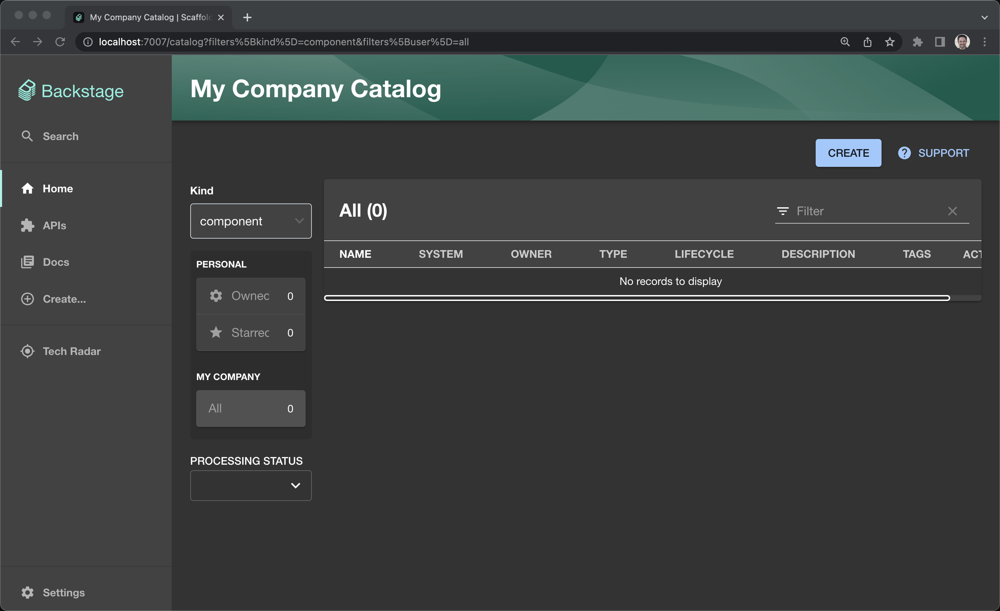
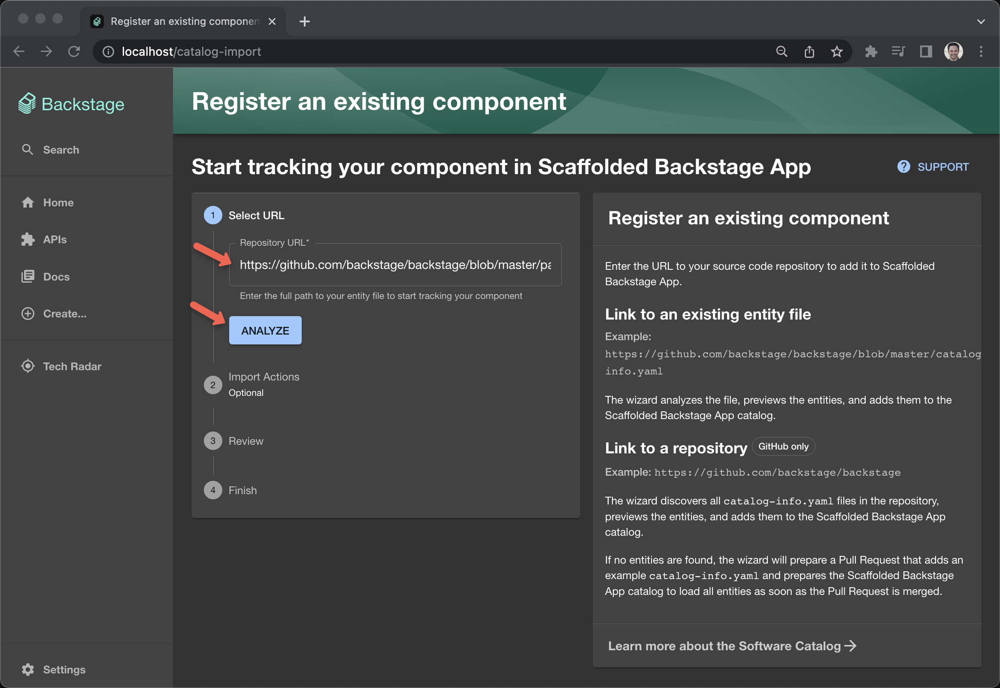
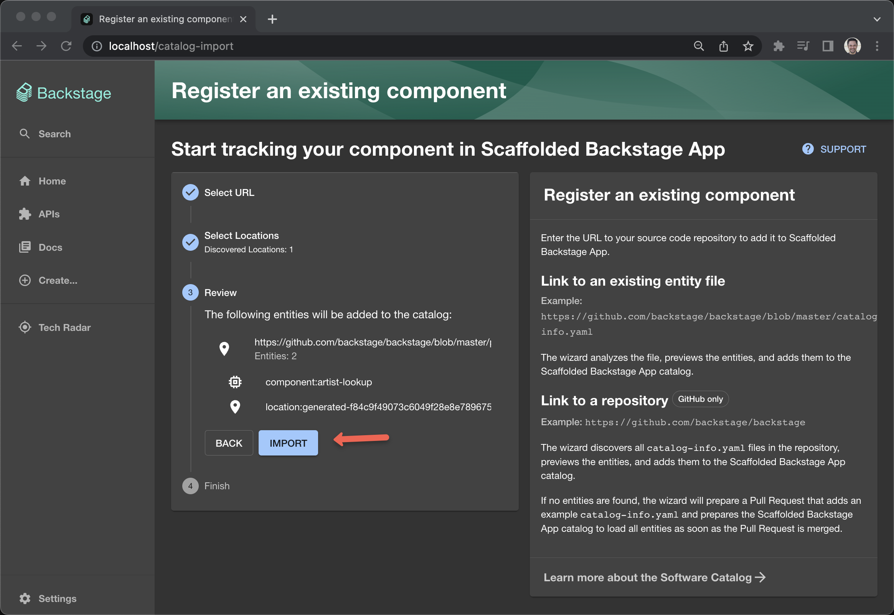
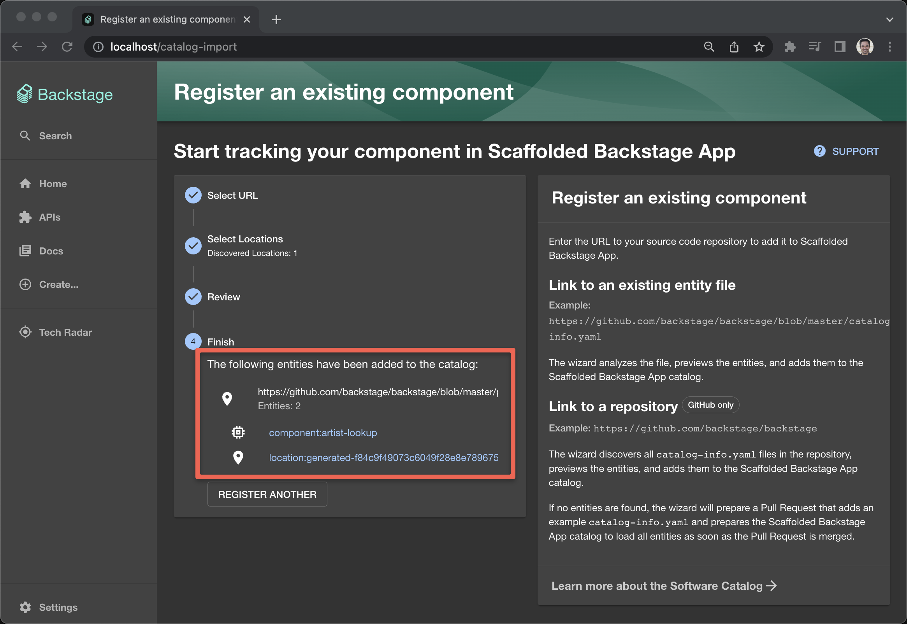
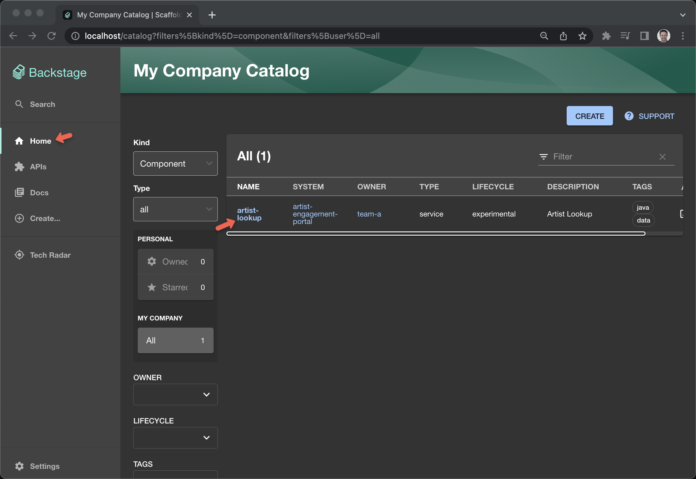
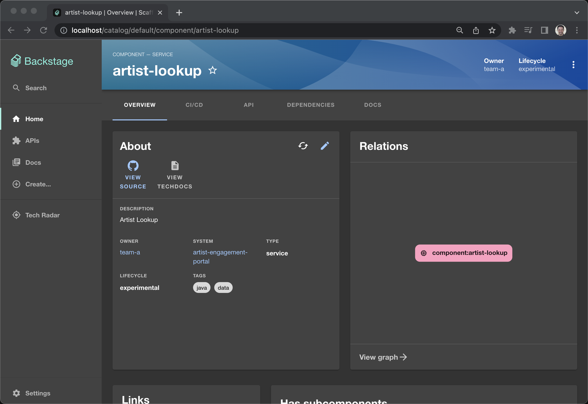

= Way 9: Kubernetes as an Application Platform

[.console-input]
[source,bash,subs="+macros,+attributes"]
----
helm version
version.BuildInfo{Version:"v3.13.1", GitCommit:"3547a4b5bf5edb5478ce352e18858d8a552a4110", GitTreeState:"clean", GoVersion:"go1.21.3"}
----

== Backstage on localhost

Need to get an appconfig

https://backstage.io/docs/getting-started/

https://github.com/nvm-sh/nvm#installing-and-updating

https://demo.backstage.io/

----
nvm install 18
nvm use 18
----

----
node -v 
v18.18.2
----

----
npm -v
9.8.1
----

----
npx @backstage/create-app@latest
----

my-backstage-app

----
brew install yarn
yarn version
yarn version v1.22.19
----

----
cd my-backstage-app

yarn add --cwd packages/backend pg
----

----
yarn dev
----

== Docker

https://backstage.io/docs/deployment/docker

----
yarn build:backend
----

----
docker image build . -f packages/backend/Dockerfile --tag backstage
----

----
docker run -it -p 7007:7007 backstage
----

== Backstage into Kubernetes

https://github.com/backstage/charts/tree/main/charts/backstage

[.console-input]
[source,bash,subs="+macros,+attributes"]
----
helm repo add bitnami https://charts.bitnami.com/bitnami
helm repo add backstage https://backstage.github.io/charts
----

[.console-input]
[source,bash,subs="+macros,+attributes"]
----
export KIND_HOME=~/devnation/12wayscloud;
export PATH=$KIND_HOME/bin:$PATH
export KUBECONFIG=$KIND_HOME/.kube/config
export KUBE_EDITOR="code -w"
----

[.console-input]
[source,bash,subs="+macros,+attributes"]
----
cat <<EOF | kind create cluster --name 12ways --config=-
kind: Cluster
apiVersion: kind.x-k8s.io/v1alpha4
nodes:
- role: control-plane
  kubeadmConfigPatches:
  - |
    kind: InitConfiguration
    nodeRegistration:
      kubeletExtraArgs:
        node-labels: "ingress-ready=true"
  extraPortMappings:
  - containerPort: 80
    hostPort: 80
    protocol: TCP
  - containerPort: 443
    hostPort: 443
    protocol: TCP
EOF
----

[.console-input]
[source,bash,subs="+macros,+attributes"]
----
kubectl create namespace backstage
kubectl config set-context --current --namespace=backstage
----

[.console-input]
[source,bash,subs="+macros,+attributes"]
----
mkdir backstage-helm-install
cd backstage-helm-install
----

[.console-input]
[source,bash,subs="+macros,+attributes"]
----
cat <<'EOF' >> values-forward-default.yaml 
backstage:
  extraEnvVars:
    - name: 'APP_CONFIG_app_baseUrl'
      value: 'http://{{ .Values.ingress.host }}:7007'
    - name: 'APP_CONFIG_backend_baseUrl'
      value: 'http://{{ .Values.ingress.host }}:7007'
    - name: 'APP_CONFIG_backend_cors_origin'
      value: 'http://{{ .Values.ingress.host }}:7007`'
 
ingress:
  enabled: false
  host: localhost
EOF
----

----
helm install my-release backstage/backstage
----

----
kubectl port-forward -n backstage svc/my-release-backstage 7007:7007
----

[.console-input]
[source,bash,subs="+macros,+attributes"]
----
helm install -n backstage --create-namespace backstage backstage/backstage -f values-forward-default.yaml
----

[.console-input]
[source,bash,subs="+macros,+attributes"]
----
kubectl port-forward -n backstage svc/backstage 7007:7007
----

[.console-input]
[source,bash,subs="+macros,+attributes"]
----
open http://localhost:7007/
----

Switch to Ingress

[.console-input]
[source,bash,subs="+macros,+attributes"]
----
cat <<'EOF' >> values-ingress-default.yaml 
backstage:
  extraEnvVars:
    - name: "APP_CONFIG_app_baseUrl"
      value: "http://{{ .Values.ingress.host }}"
    - name: "APP_CONFIG_backend_baseUrl"
      value: "http://{{ .Values.ingress.host }}"
    - name: "APP_CONFIG_backend_cors_origin"
      value: "http://{{ .Values.ingress.host }}`"

ingress:
  enabled: true
  host: localhost
EOF
----

[.console-input]
[source,bash,subs="+macros,+attributes"]
----
helm upgrade -n backstage my-release backstage/backstage -f values-ingress-default.yaml
----

[.console-input]
[source,bash,subs="+macros,+attributes"]
----
open http://localhost/catalog
----

=== Add a Components

https://backstage.io/docs/features/software-catalog/software-catalog-overview

image::./images/backstage-1.png[]

https://github.com/backstage/backstage/blob/master/packages/catalog-model/examples/components/artist-lookup-component.yaml

=== Add other Components

https://github.com/backstage/backstage/blob/master/packages/catalog-model/examples/components/petstore-component.yaml

== Clean Up

Clean up KinD
----
kind delete cluster --name 12ways
----

Really clean

----
rm -rf .kube
----

Clean up Docker

If you wish to more fully scrub all things from your Docker Daemon to get back to a fresh start
----
docker rm `docker ps -a -q`
docker rmi `docker images -a -q`
----
