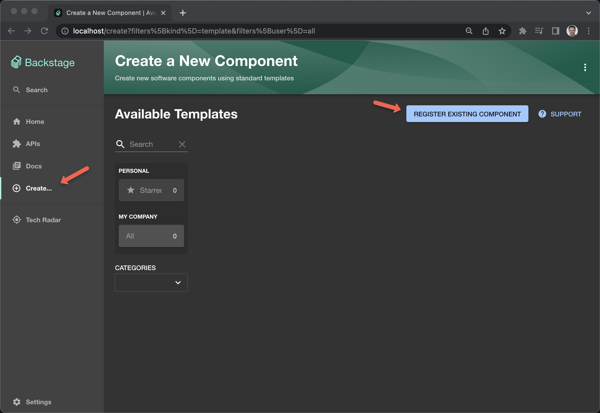

= Way 2: Kubernetes as an Application Platform

[.console-input]
[source,bash,subs="+macros,+attributes"]
----
helm version
version.BuildInfo{Version:"v3.11.0", GitCommit:"472c5736ab01133de504a826bd9ee12cbe4e7904", GitTreeState:"clean", GoVersion:"go1.19.5"}
----

== Backstage:

[.console-input]
[source,bash,subs="+macros,+attributes"]
----
helm repo add bitnami https://charts.bitnami.com/bitnami
helm repo add backstage https://backstage.github.io/charts
----

[.console-input]
[source,bash,subs="+macros,+attributes"]
----
mkdir backstage-helm-install
cd backstage-helm-install
----

[.console-input]
[source,bash,subs="+macros,+attributes"]
----
cat <<'EOF' >> values-forward-default.yaml 
backstage:
  extraEnvVars:
    - name: 'APP_CONFIG_app_baseUrl'
      value: 'http://{{ .Values.ingress.host }}:7007'
    - name: 'APP_CONFIG_backend_baseUrl'
      value: 'http://{{ .Values.ingress.host }}:7007'
    - name: 'APP_CONFIG_backend_cors_origin'
      value: 'http://{{ .Values.ingress.host }}:7007`'
 
ingress:
  enabled: false
  host: localhost
EOF
----

[.console-input]
[source,bash,subs="+macros,+attributes"]
----
helm install -n backstage --create-namespace backstage backstage/backstage -f values-forward-default.yaml
----

[.console-input]
[source,bash,subs="+macros,+attributes"]
----
kubectl port-forward -n backstage svc/backstage 7007:7007
----

[.console-input]
[source,bash,subs="+macros,+attributes"]
----
open http://localhost:7007/
----

image::./images/backstage-forward.png[]

Switch to Ingress

[.console-input]
[source,bash,subs="+macros,+attributes"]
----
cat <<'EOF' >> values-ingress-default.yaml 
backstage:
  extraEnvVars:
    - name: "APP_CONFIG_app_baseUrl"
      value: "http://{{ .Values.ingress.host }}"
    - name: "APP_CONFIG_backend_baseUrl"
      value: "http://{{ .Values.ingress.host }}"
    - name: "APP_CONFIG_backend_cors_origin"
      value: "http://{{ .Values.ingress.host }}`"

ingress:
  enabled: true
  host: localhost
EOF
----

[.console-input]
[source,bash,subs="+macros,+attributes"]
----
cat <<'EOF' >> values-ingress-default.yaml 
backstage:
  extraEnvVars:
    - name: "APP_CONFIG_app_baseUrl"
      value: "http://{{ .Values.ingress.host }}/backstage"
    - name: "APP_CONFIG_backend_baseUrl"
      value: "http://{{ .Values.ingress.host }}/backstage"
    - name: "APP_CONFIG_backend_cors_origin"
      value: "http://{{ .Values.ingress.host }}/backstage`"

ingress:
  enabled: true
  host: localhost
EOF
----

[.console-input]
[source,bash,subs="+macros,+attributes"]
----
helm upgrade -n backstage backstage backstage/backstage -f values-ingress-default.yaml
----

[.console-input]
[source,bash,subs="+macros,+attributes"]
----
open http://localhost
----

=== Add a Components

https://backstage.io/docs/features/software-catalog/software-catalog-overview

https://github.com/backstage/backstage/blob/master/packages/catalog-model/examples/components/artist-lookup-component.yaml

image::./images/backstage-4.png[]

image::./images/backstage-6.png[]

=== Add other Components

https://github.com/backstage/backstage/blob/master/packages/catalog-model/examples/components/www-artist-component.yamls

https://github.com/backstage/backstage/blob/master/packages/catalog-model/examples/components/petstore-component.yaml

